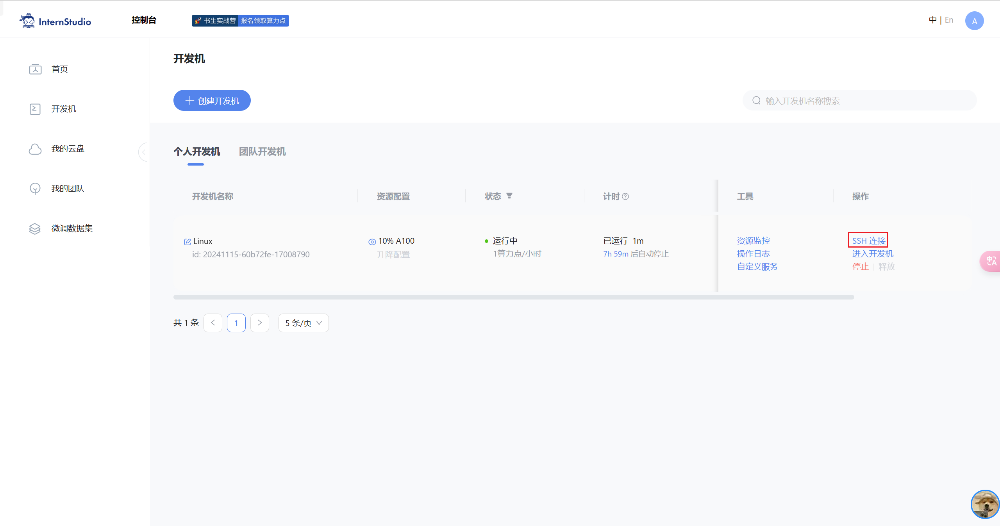
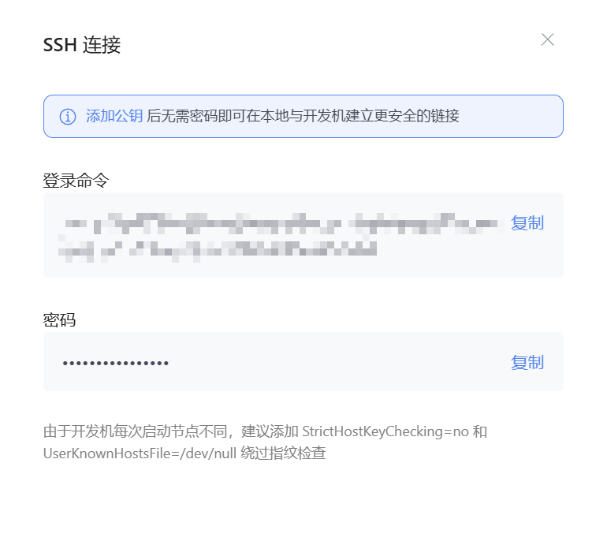

# Linux 前置基础（基本命令、SSH及端口映射）

## 闯关任务：完成SSH连接与端口映射并运行 `hello_world.py`

首先，需要创建一个开发机。

登录 `https://studio.intern-ai.org.cn/`之后，进入下图界面，点击创建开发机。

然后选择好想要的镜像和资源

立即创建即可。

任务是ssh连接

现在开始连接一下~先点击一下SSH连接。

会跳出下面弹框，复制一下下面的登录命令内容即可：

教程用的VSCode，这里就一样了，也用这玩意儿吧。

打开VSCode，然后打开插件 `Remote-SSH`（我提前安装了，如果没有装的话需要自己在拓展市场里面自己搜索一下安装）

第一次需要输入这个ssh的命令，直接黏贴进去我们刚刚复制的即可。

多余的配置可以不管，直接下一步就完事了，完事会跳出来一个新的窗口

选择linux，随后等待一下，可能需要一丢丢时间，他会出现叫你输入密码，密码就是网站上面给我们的。

就连上了~

接下来是完成端口映射并运行 `hello_world.py`

选择一下打开的文件夹先，也是就在 `/root/`就可以了，记得再输一次密码~

进去了，然后我们复制一下文档里面的 `hello_wrold.py`的内容，给他放进去完事。

但是，现在要先运行这玩意儿还缺一个 `gradio`的库，需要安装一下。在终端里面输入一下安装命令 `pip install gradio`

就可以了(文档里面限制了版本，我没有……不知道后面会不会有问题)

最后，VSCode里面输入一下 `python hello_world.py`

显示出这个（在VSCode里面不知道为什么反应特别慢……总要等一会儿）就可以了

另外，开一个终端，在powershell里面输入下面的命令，这个具体命令自己去翻自定义服务里面就有捏，记得输入密码

最后就是这样~

至此所有的基本任务完成了。
