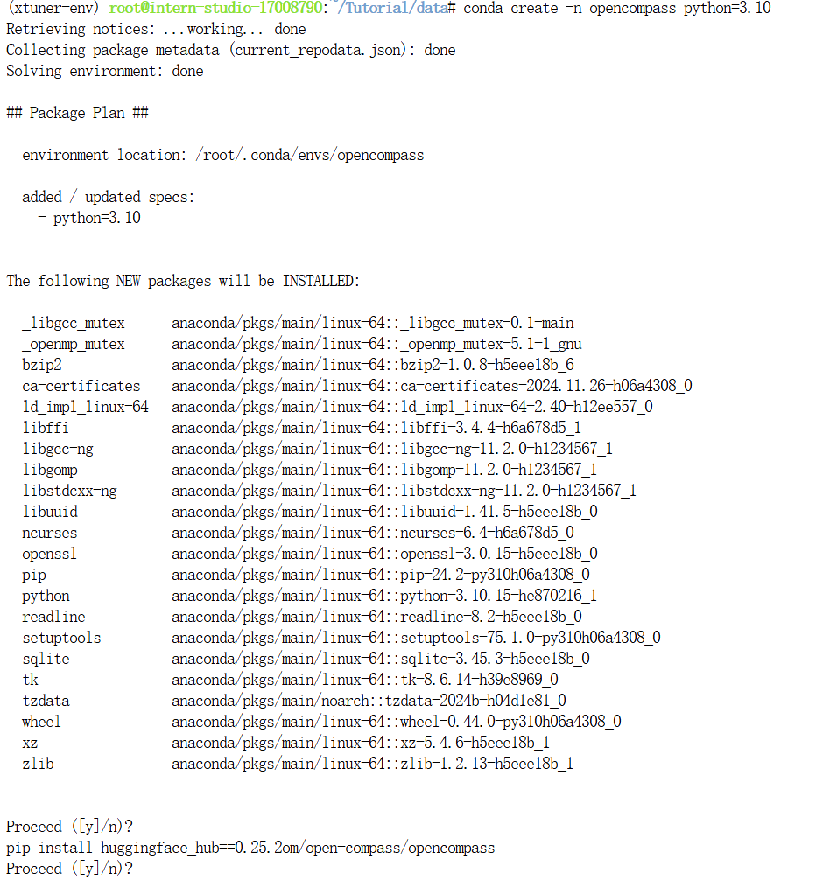
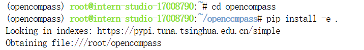
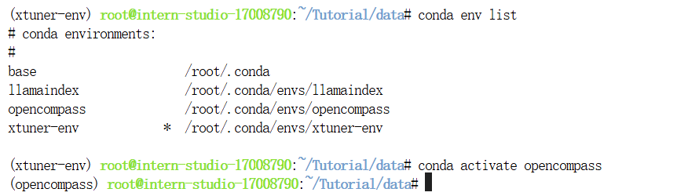
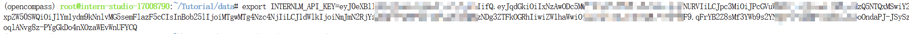
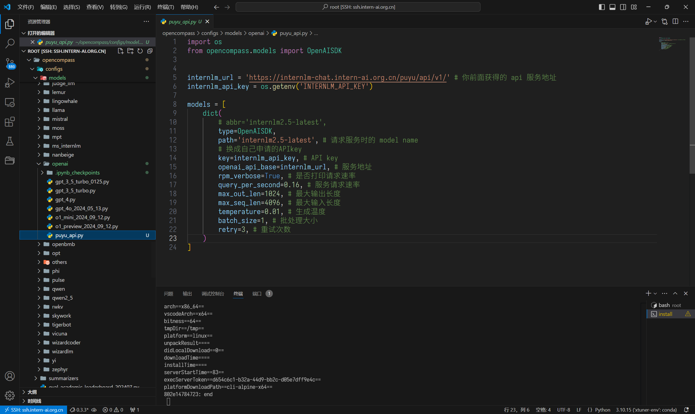
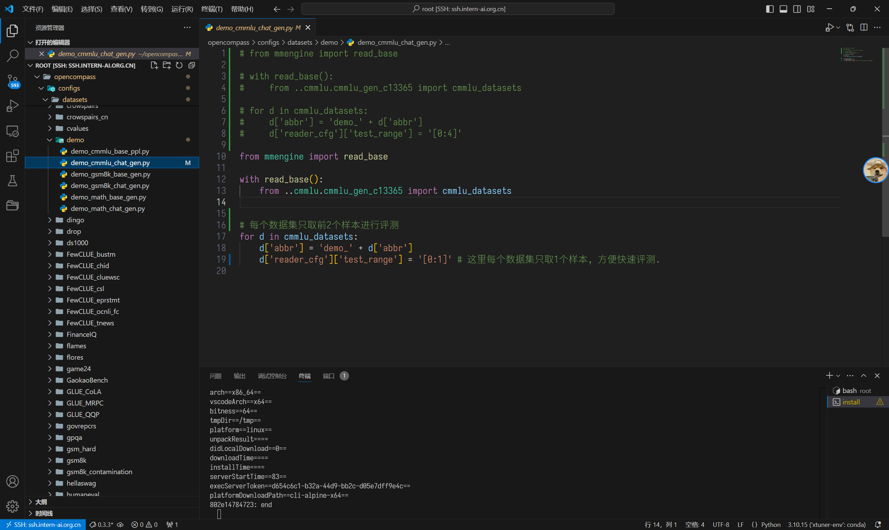
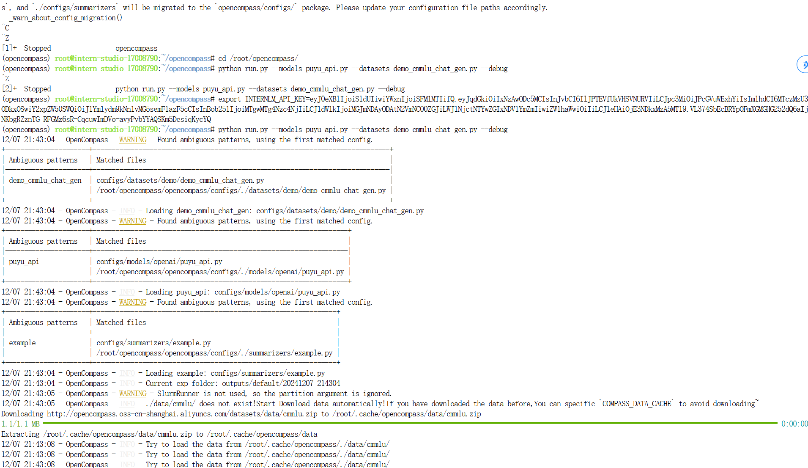
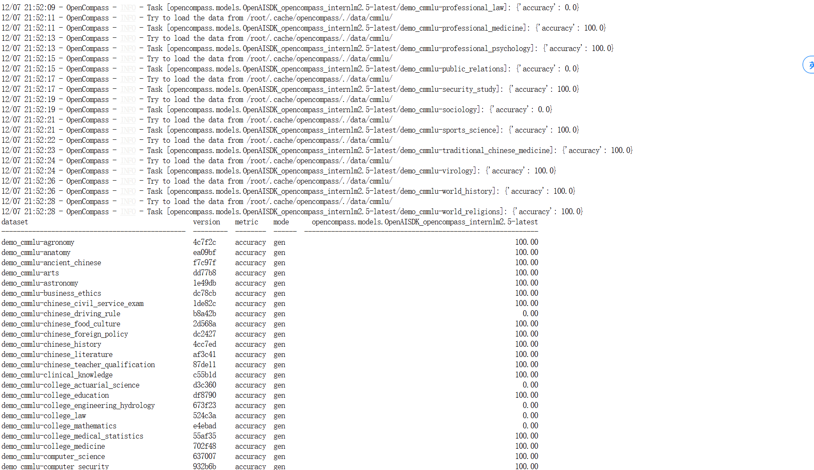
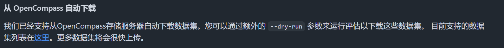
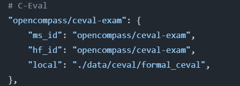

# Evaluation

## 基础任务
* 使用 OpenCompass 评测浦语 API 记录复现过程并截图。
* 使用 OpenCompass 评测 internlm2.5-chat-1.8b 模型在 ceval 数据集上的性能，记录复现过程并截图。

这个任务其实不是很难，我们只需要获取api，然后对数据集配置，然后完成就可以了。

```
conda create -n opencompass python=3.10
conda activate opencompass

cd /root
git clone -b 0.3.3 https://github.com/open-compass/opencompass
cd opencompass
pip install -e .
pip install -r requirements.txt
pip install huggingface_hub==0.25.2
```
这里按照文档给的安装会出问题，我发现后面会报错，好像是因为pip版本高了就不支持这种安装方式……查看官方中文文档后，加上以下命令：
```
pip install -U opencompass
```






安装完成~



因为我这边的token有现成的，所以简单搞一下就可以了。

```
export INTERNLM_API_KEY=XXXXX # 填入你申请的 API Key
```



然后改一个文件和加一个文件



接下来就是运行：


结果就是这样~


这个完成了，接下来就是完成对本地模型（internlm2.5-chat-1.8b）在 ceval 数据集上的测评

我感觉应该不算难，让我小小研究一下~
通过查看官方文档，看到我们数据可以在这里找到

