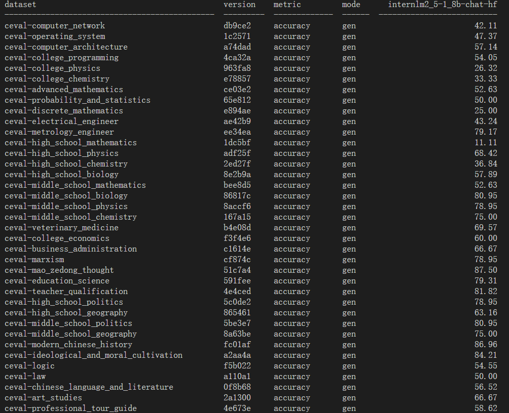
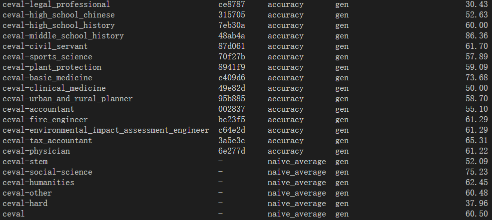

# Evaluation

## 基础任务

* 使用 OpenCompass 评测浦语 API 记录复现过程并截图。
* 使用 OpenCompass 评测 internlm2.5-chat-1.8b 模型在 ceval 数据集上的性能，记录复现过程并截图。

这个任务其实不是很难，我们只需要获取api，然后对数据集配置，然后完成就可以了。

```
conda create -n opencompass python=3.10
conda activate opencompass

cd /root
git clone -b 0.3.3 https://github.com/open-compass/opencompass
cd opencompass
pip install -e .
pip install -r requirements.txt
pip install huggingface_hub==0.25.2
```

这里按照文档给的安装会出问题，我发现后面会报错，好像是因为pip版本高了就不支持这种安装方式……查看官方中文文档后，加上以下命令：

```
pip install -U opencompass
```


安装完成~


因为我这边的token有现成的，所以简单搞一下就可以了。

```
export INTERNLM_API_KEY=XXXXX # 填入你申请的 API Key
```


然后改一个文件和加一个文件


接下来就是运行：


结果就是这样~


这个完成了，接下来就是完成对本地模型（internlm2.5-chat-1.8b）在 ceval 数据集上的测评

我感觉应该不算难，让我小小研究一下~

我们可以将数据集先下载下来~

```
wget https://github.com/open-compass/opencompass/releases/download/0.2.2.rc1/OpenCompassData-core-20240207.zip
unzip OpenCompassData-core-20240207.zip
```
然后解压完成后，对`/config/models/hf_internlm/`路径下的` hf_internlm2_5_1_8b_chat.py`文件小小的修改一下。

```
from opencompass.models import HuggingFacewithChatTemplate

models = [
    dict(
        type=HuggingFacewithChatTemplate,
        abbr='internlm2_5-1_8b-chat-hf',
        path='/share/new_models/Shanghai_AI_Laboratory/internlm2_5-1_8b-chat/',
        max_out_len=2048,
        batch_size=8,
        run_cfg=dict(num_gpus=1),
    )
]

python run.py --datasets ceval_gen --models hf_internlm2_5_1_8b_chat --debug
```

然后开始运行即可。
```
python run.py --datasets ceval_gen --models hf_internlm2_5_1_8b_chat --debug
```
运行这个会花掉一些时间，需要一定耐心。下面是结果的截图：


