# LMDeploy

## 基础任务

- 使用结合W4A16量化与kv cache量化的internlm2_5-1_8b-chat模型封装本地API并与大模型进行一次对话，作业截图需包括显存占用情况与大模型回复，参考4.1 API开发(优秀学员必做)，请注意2.2.3节与4.1节应使用作业版本命令。
- 使用Function call功能让大模型完成一次简单的"加"与"乘"函数调用，作业截图需包括大模型回复的工具调用情况，参考4.2 Function call(选做)

### 默认的显存计算

作业需要我们截图显存占用情况，这里我们也照文档的描述先做一个简单的计算吧

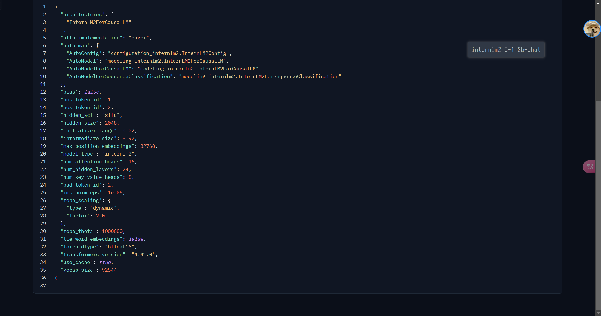

同样也是`bfloat16`的格式，那么可以得到模型的权重大小约为：

```1.8×10^9 parameters×2 Bytes/parameter=3.6GB```

yysy，确实比文档给的例子小很多

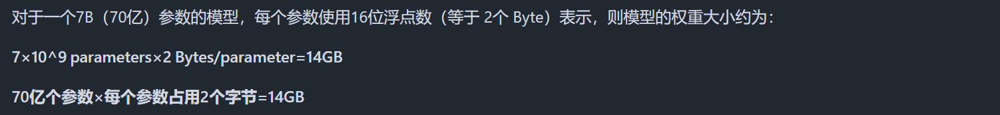这是文档里面的显存占用……

简单地开一个新的虚拟环境。这里的命令和文档一致(我就不截图了，这个内容也很简单的……反正尽量按照要求的版本来吧，我已经看到之前实验有人没有指定版本然后踩坑的了……)

```
conda create -n lmdeploy  python=3.10 -y
conda activate lmdeploy
conda install pytorch==2.1.2 torchvision==0.16.2 torchaudio==2.1.2 pytorch-cuda=12.1 -c pytorch -c nvidia -y
pip install timm==1.0.8 openai==1.40.3 lmdeploy[all]==0.5.3
pip install datasets==2.19.2
```

这里根据作业要求，我们做的是`internlm2_5-1_8b-chat`所以只用下面的命令~（当然，我这边因为之前的作业原因，其实这个文件我已经软链接过来了，我就没有用这个命令）


```
ln -s /root/share/new_models/Shanghai_AI_Laboratory/internlm2_5-1_8b-chat /root/models
```

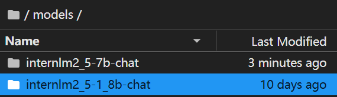

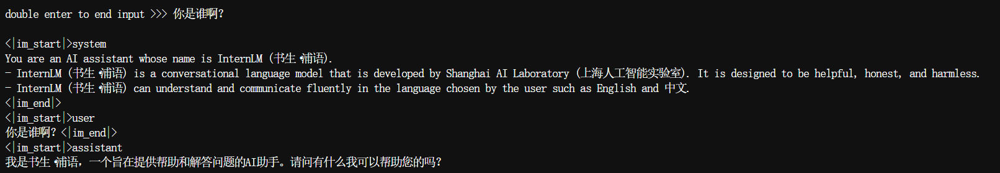

很好，可用~

然后显存占用情况如下:

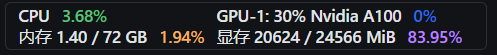

一样的计算，因为总显存为24GB，减去我们权重3.6GB，还剩余20.4GB，占用剩余空间的80%，也就是16.32。权重和kv cache两者相加总共也就是19.92GB，实际加载模型后，其他项也会占用部分显存，因此剩余显存比理论偏低，实际占用会略高于理论值~

### 结合W4A16 量化+ KV cache+KV cache 量化的显存实际使用

接下来我们先W4A16量化一下
```
lmdeploy lite auto_awq \
   /root/models/internlm2_5-1_8b-chat \
  --calib-dataset 'ptb' \
  --calib-samples 128 \
  --calib-seqlen 2048 \
  --w-bits 4 \
  --w-group-size 128 \
  --batch-size 1 \
  --search-scale False \
  --work-dir /root/models/internlm2_5-1_8b-chat-w4a16-4bit
```

这一步会消耗比较长的时间，可以一边干别的事情一边等……
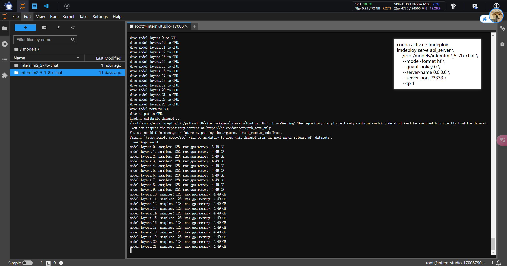

终于好了
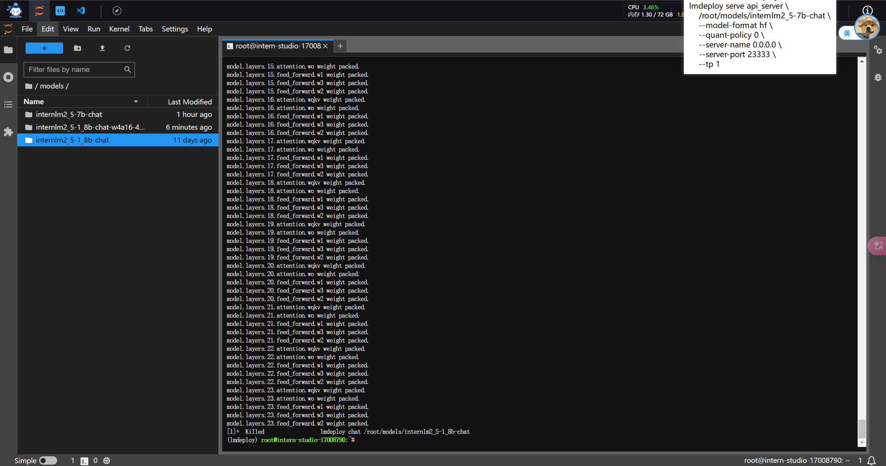


按照文档的提示，我们可以再设置一下kv cache，直接使用下面的命令即可：
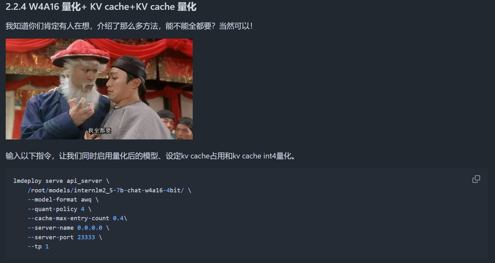


这里我觉得唯一会踩的坑应该就是启动的文件吧……其他应该不会吧
```
lmdeploy serve api_server \
    /root/models/internlm2_5-1_8b-chat-w4a16-4bit \
    --model-format awq \
    --quant-policy 4 \
    --cache-max-entry-count 0.1\
    --server-name 0.0.0.0 \
    --server-port 23333 \
    --tp 1
```

启动了~
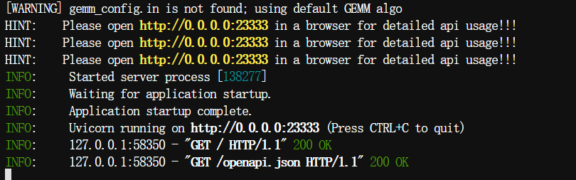

做好端口映射即可
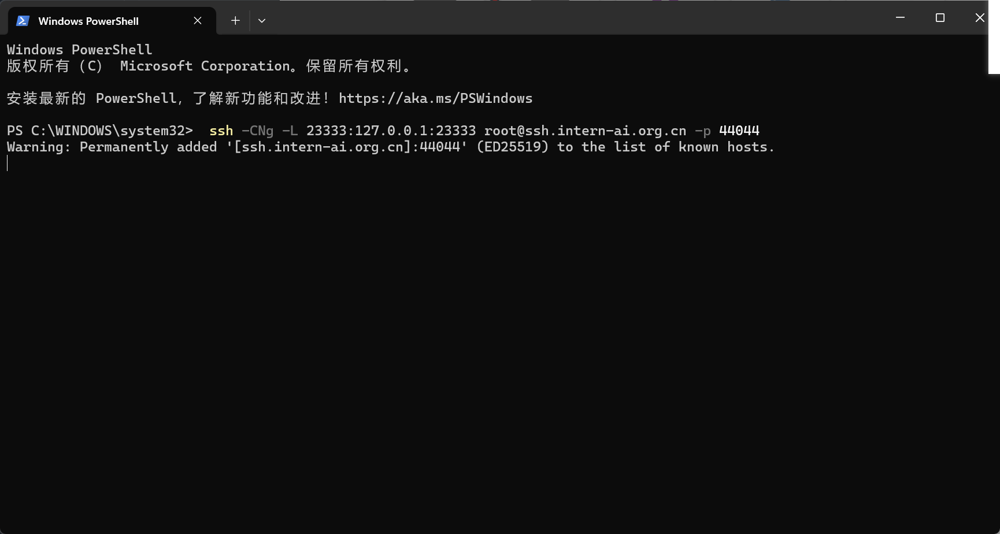

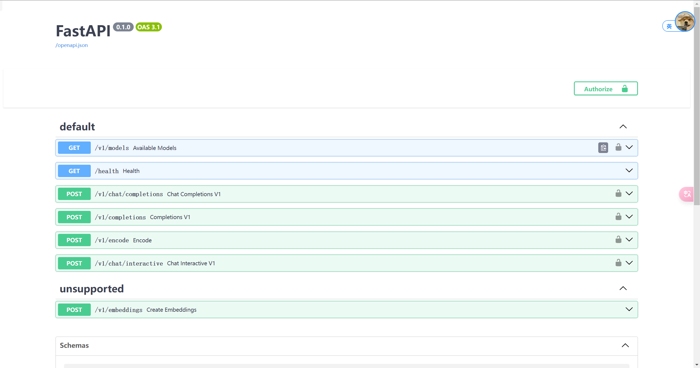


然后我们这边直接使用命令行形式连接API服务器了

在第二个窗口输入：
```
conda activate lmdeploy
lmdeploy serve api_client http://localhost:23333
```
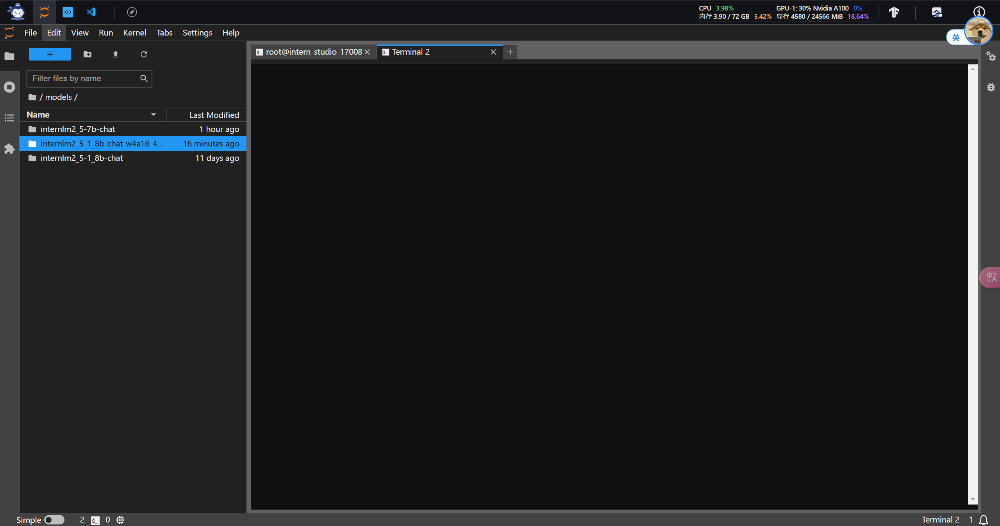

出现对话框~
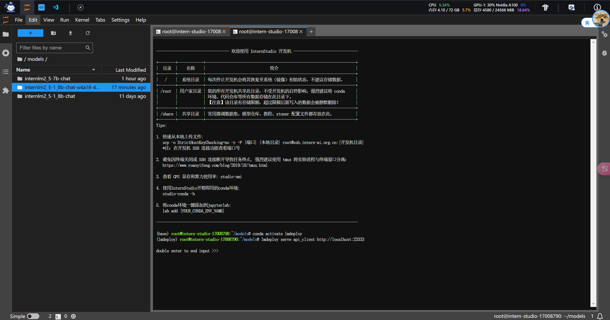
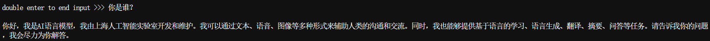

这里可以看到，显存占用只有4.9G比以前确实是少了非常多。
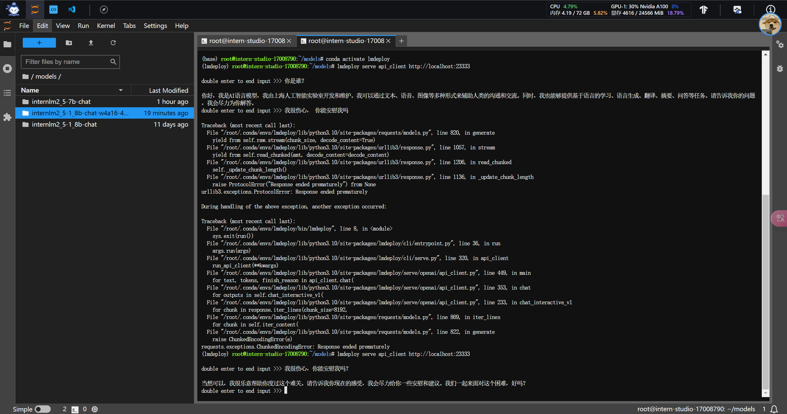

