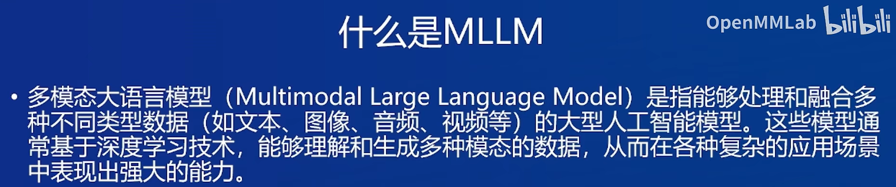
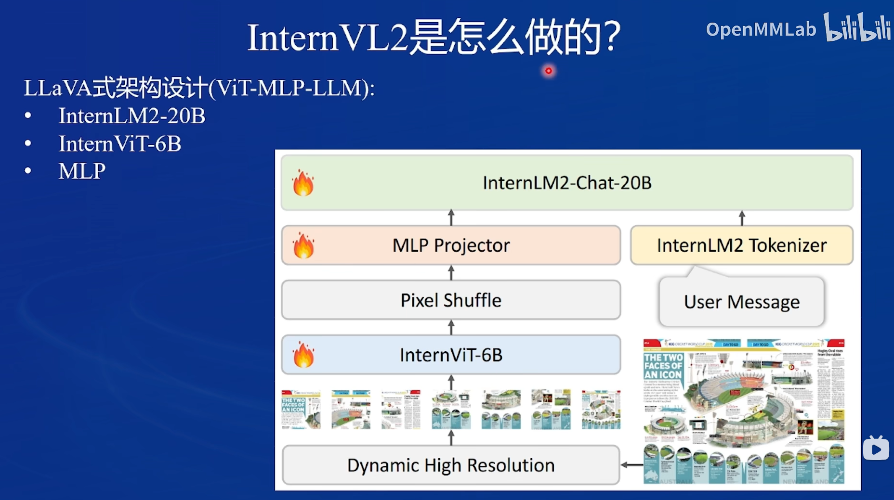
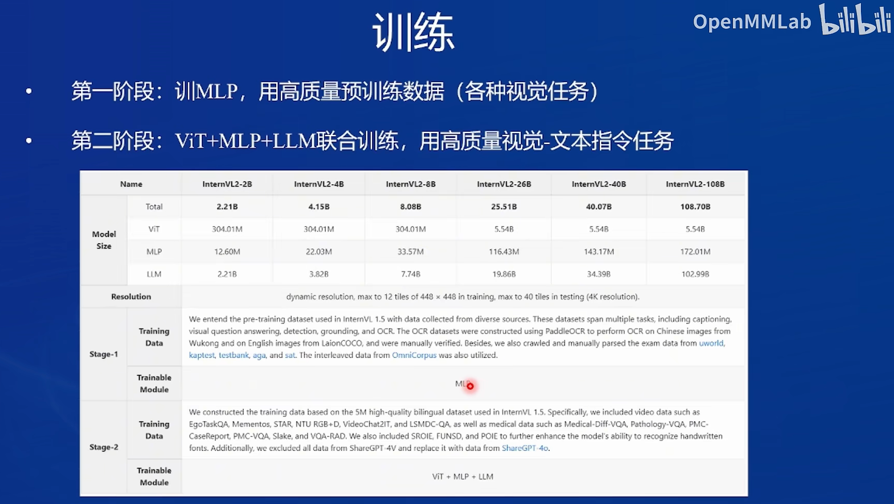

# InternVL

## 基础任务

- 理解多模态大模型的常见设计模式，可以大概讲出多模态大模型的工作原理。
- 了解InternVL2的设计模式，可以大概描述InternVL2的模型架构和训练流程。
- 了解LMDeploy部署多模态大模型的核心代码，并运行提供的gradio代码，在UI界面体验与InternVL2的对话。
- 了解XTuner，并利用给定数据集微调InternVL2-2B后，再次启动UI界面，体验模型美食鉴赏能力的变化。

多模态大语言模型的定义：

我的理解是，多模态就是多种不同的数据类型，例如图片、音频、文本，这些对我们而言都是不一样的东西，但是对于机器而言，其实他们都是可以使用二进制表达的，多模态大语言模型能够实现支持多种不同类型的数据输入和输出，应该就是通过了编码器将各类数据转换为数字向量，然后借助一些方法，将我们编码的不同模态的特征向量对齐到同一模态。

INternVL2的模型架构：

InternVL2的训练流程

