# InternVL

## 基础任务

- 理解多模态大模型的常见设计模式，可以大概讲出多模态大模型的工作原理。
- 了解InternVL2的设计模式，可以大概描述InternVL2的模型架构和训练流程。
- 了解LMDeploy部署多模态大模型的核心代码，并运行提供的gradio代码，在UI界面体验与InternVL2的对话。
- 了解XTuner，并利用给定数据集微调InternVL2-2B后，再次启动UI界面，体验模型美食鉴赏能力的变化。

多模态大语言模型的定义：


我的理解是，多模态就是多种不同的数据类型，例如图片、音频、文本，这些对我们而言都是不一样的东西，但是对于机器而言，其实他们都是可以使用二进制表达的，多模态大语言模型能够实现支持多种不同类型的数据输入和输出，应该就是通过了编码器将各类数据转换为数字向量，然后借助一些方法，将我们编码的不同模态的特征向量对齐到同一模态。

INternVL2的模型架构：


InternVL2的训练流程


这里因为之前的作业已经有了xtuner-env和lmdeploy环境，但是我看了看貌似里面有的东西和今天需要的又有点点不一样啊，我这边为了避免做到后面出问题，还是完全按照文档来的好……

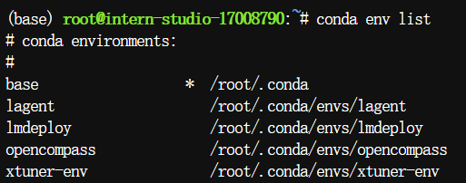

这里可以看到之前课程所使用的版本和我们今天文档要求下载的是不一样的
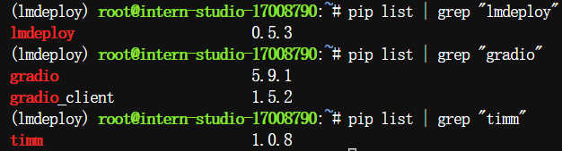

创建环境xtuner-env02和lmdeploy02并且下载好要求的库

```
conda create --name xtuner-env02 python=3.10 -y
conda activate xtuner-env02
pip install xtuner==0.1.23 timm==1.0.9
pip install 'xtuner[deepspeed]'
pip install torch==2.4.1 torchvision==0.19.1 torchaudio==2.4.1 --index-url https://download.pytorch.org/whl/cu121
pip install transformers==4.39.0 tokenizers==0.15.2 peft==0.13.2 datasets==3.1.0 accelerate==1.2.0 huggingface-hub==0.26.5 
conda create -n lmdeploy02 python=3.10 -y
conda activate lmdeploy02
pip install lmdeploy==0.6.1 gradio==4.44.1 timm==1.0.9
```

这里安装需要一点点时间，耐心等待即可

这里我们在lmdeploy02环境下输入下面的命令：(因为是开发机所以不需要改动任何东西，以上命令直接在vscode做可以免去后续的端口映射)

```
git clone https://github.com/Control-derek/InternVL2-Tutorial.git
cd InternVL2-Tutorial
python demo.py
```

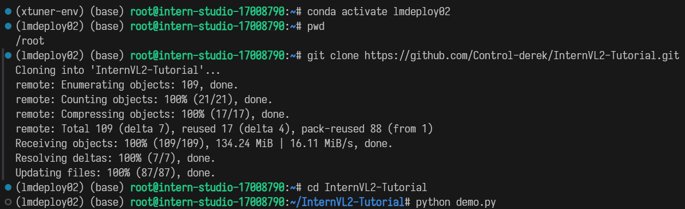

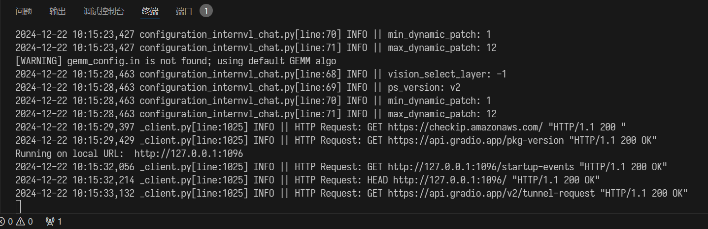

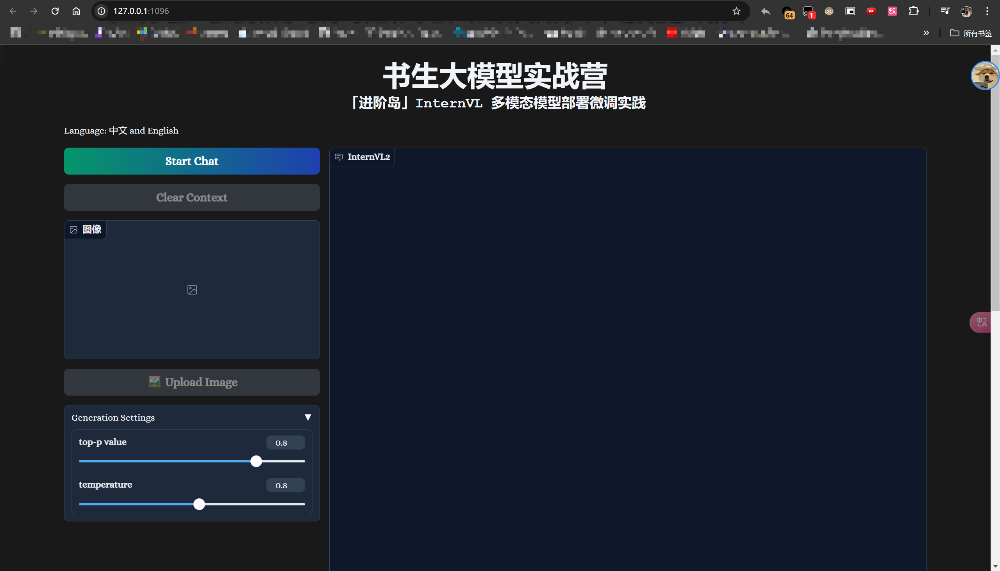

我选择了这个图，应该是一道凉菜吧……鸭肉

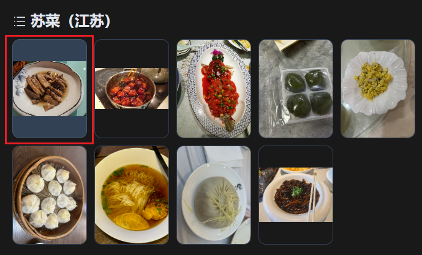

实测结果，还好他认出了这是鸭子（难蚌

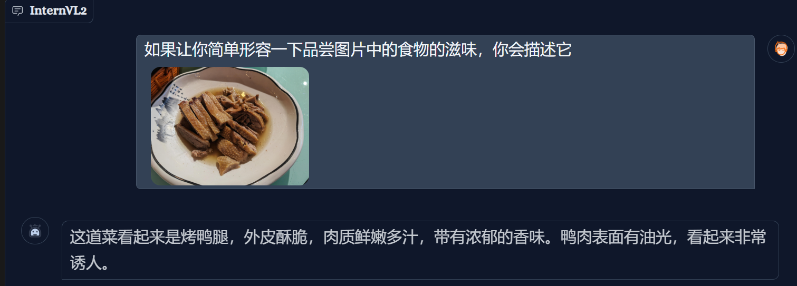

果然第二张图片出问题了……

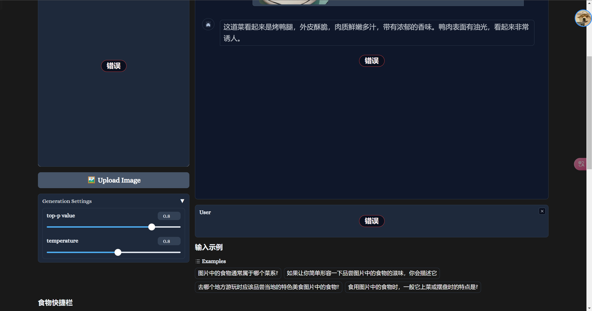
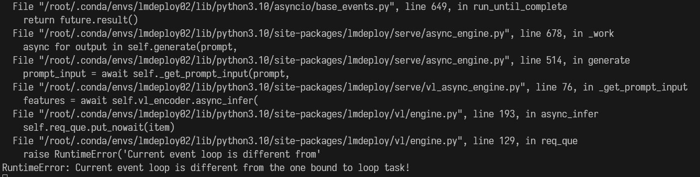

对报错的那个文件的第126、127行作出修改

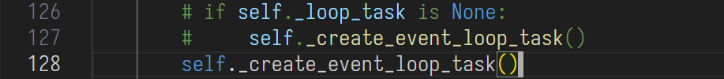

重新启动一下，好了，可以了~

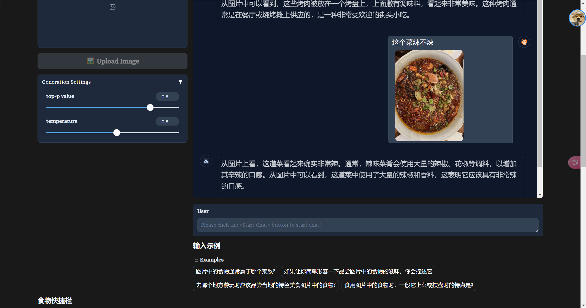

复制一下原始internvl的微调配置文件到 `/root/xtuner/xtuner/configs/internvl/v2/`这里

```
cp /root/InternVL2-Tutorial/xtuner_config/internvl_v2_internlm2_2b_lora_finetune_food.py /root/xtuner/xtuner/configs/internvl/v2/internvl_v2_internlm2_2b_lora_finetune_food.py
```

这边再下载数据集的时候出现了问题，结果发现是我忘记向仓库主人申请了……

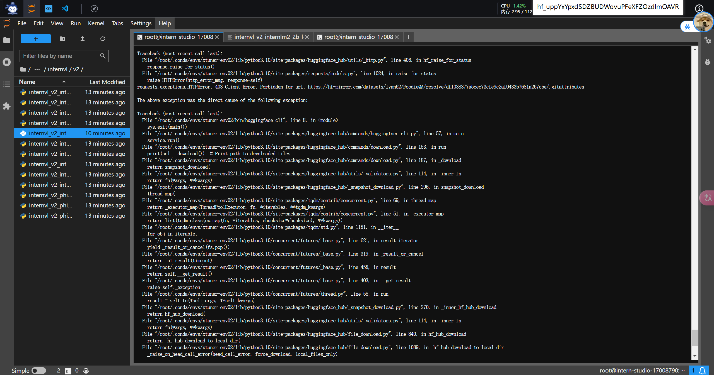

申请是需要花时间的，所以小小地搁置一下我的作业，难顶（什么时候审批通过捏

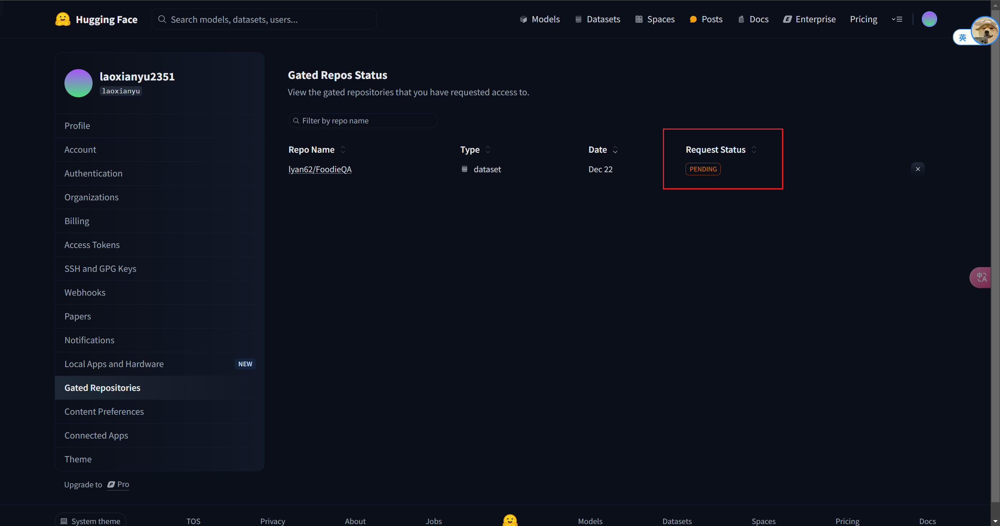

然后看到了文档后面的话……

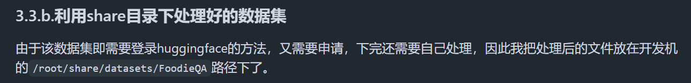

我一个裂开


在这儿有现成的

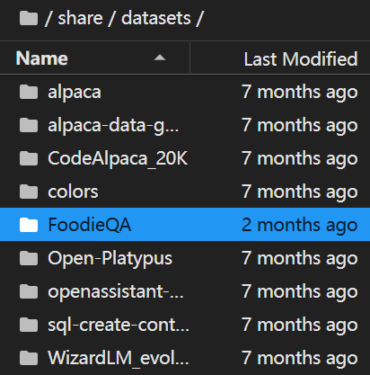


属于是自己不仔细看了……

但是又出问题了……
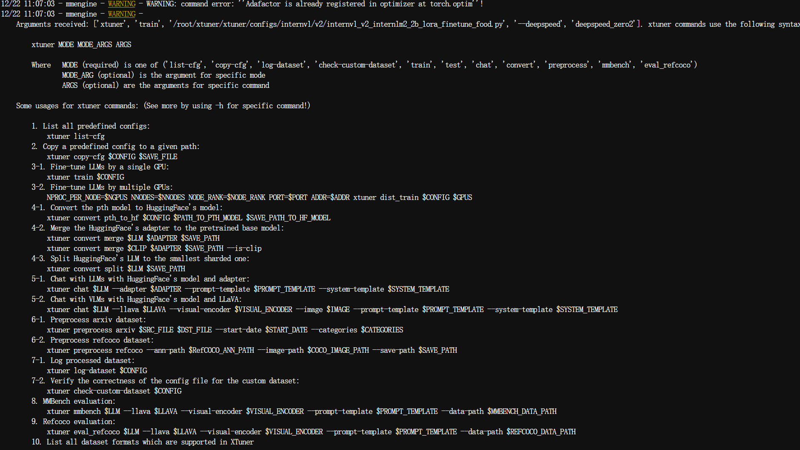

[网上查找](https://github.com/InternLM/xtuner/issues/952)后，说是pytorch版本太高？
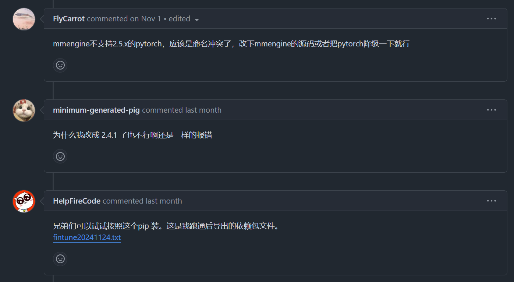

我仔细看了文档，给的版本没有错（就是2.4.1），但是不知道为什么安装完了之后最终的torch版本就不对了（变成了2.5.1）……很奇怪，待我重新修改一下版本再战~

这里我重新安装了torch那些东西，然后在启动训练时显示没有deepspeed，也是一样的，缺啥我们补啥就是了


最后使用以下命令进行训练：

```
xtuner train /root/xtuner/xtuner/configs/internvl/v2/internvl_v2_internlm2_2b_lora_finetune_food.py --deepspeed deepspeed_zero2
```

有了有了，成功咯~

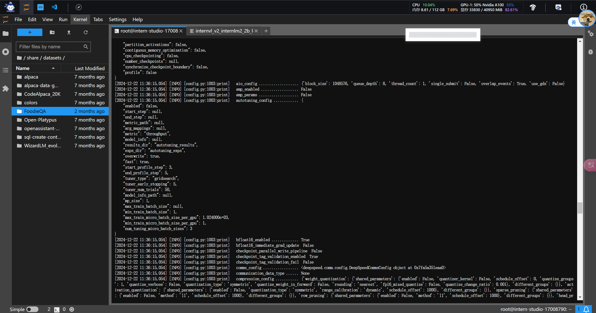

显存占用也是库库高

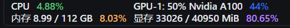

接下来就是耐心等待咯（比较花时间，建议扔一边自己去干别的事情）
