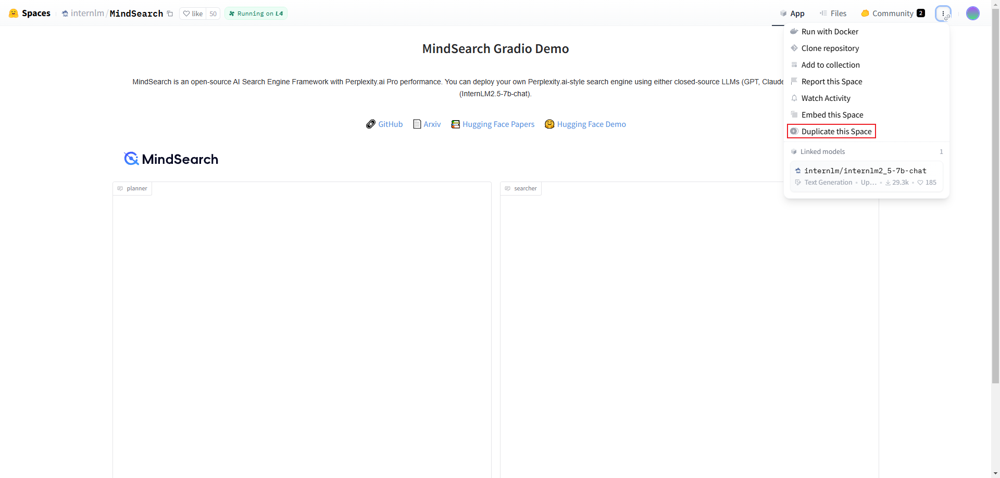
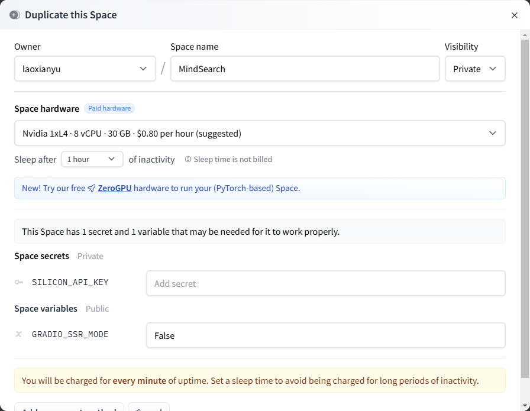
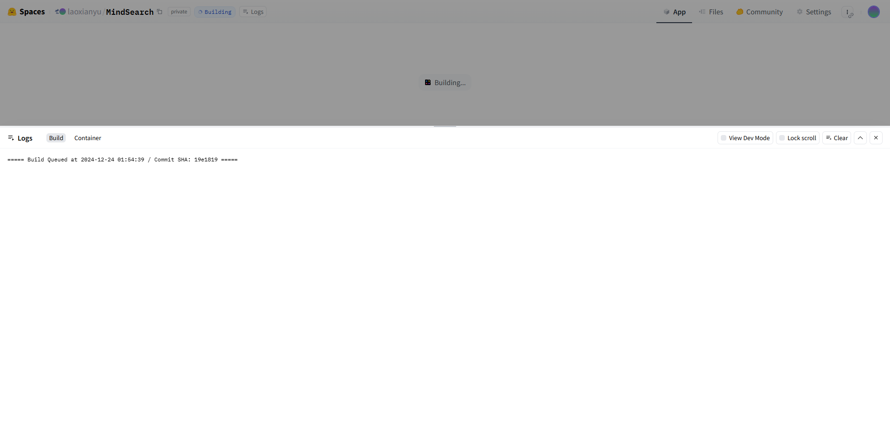
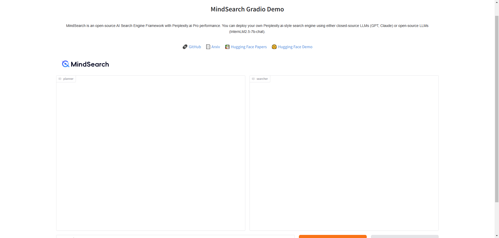
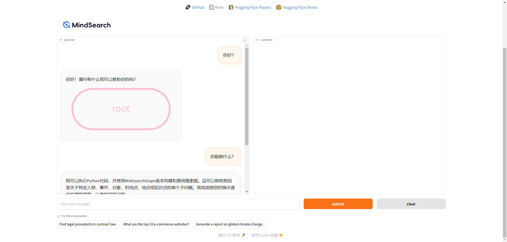

# MindSearch

## 闯关任务

闯关任务需要在关键步骤当中截图！

| 任务                                   | 描述                                                                                                                                                                                      |
| -------------------------------------- | ----------------------------------------------------------------------------------------------------------------------------------------------------------------------------------------- |
| 部署MindSearch到 hugging face Spaces上 | 在[官方的MindSearch页面](https://huggingface.co/spaces/internlm/MindSearch) 复制Spaces应用到自己的Spaces下，Space 名称中需要包含 MindSearch 关键词，请在必要的步骤以及成功的对话测试结果当中 |

这里的要求是直接复制？？看了看文档，这个貌似很简单啊。

我们登录[HF的官方仓库](https://huggingface.co/spaces/internlm/MindSearch)，然后直接复制~

然后这边需要我们提供SILICON_API_KEY，即硅基流动的API KEY（对了，那个硬件选择不要选要马内的，我们没有钱）

输入进去后他会自己启动

这边直接测试一下，没有问题……

