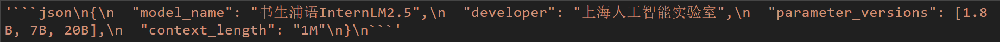

# Python基础

## 任务一 Leetcode 383(笔记中提交代码与leetcode提交通过截图)


```python
class Solution:
    def canConstruct(self, ransomNote: str, magazine: str) -> bool:
        listLetter = ["a","b","c","d","e","f","g","h","i","j","k","l","m","n","o","p","q","r","s","t","u","v","w","x","y","z"]
        dictRansomNote = {"a":0,"b":0,"c":0,"d":0,"e":0,"f":0,"g":0,"h":0,"i":0,"j":0,"k":0,"l":0,"m":0,"n":0,"o":0,"p":0,"q":0,"r":0,"s":0,"t":0,"u":0,"v":0,"w":0,"x":0,"y":0,"z":0}
        dictMagazine = {"a":0,"b":0,"c":0,"d":0,"e":0,"f":0,"g":0,"h":0,"i":0,"j":0,"k":0,"l":0,"m":0,"n":0,"o":0,"p":0,"q":0,"r":0,"s":0,"t":0,"u":0,"v":0,"w":0,"x":0,"y":0,"z":0}
        for subLetter in ransomNote:
            dictRansomNote[subLetter] += 1
        for subLetter in magazine:
            dictMagazine[subLetter] += 1
        for letter in listLetter:
            if dictRansomNote[letter] > dictMagazine[letter]:
                return False
        return True  

        # from collections import Counter
        # return Counter(ransomNote) <= Counter(magazine)

```

其实主要的思想就是，将所有要写的字拆成单个字母统计数字，例如ransomNote为“ashudghuad”时a就是2，b就是0，c就是……（以此类推），然后再看看我们magazine的对应的字母数量，二者比较一下，一旦ransomNote对应字母大于了magazine对应数量后就返回false即可，否则全部跑完就返回一个True。

另外用下面注释掉的那个方法的话，会更快……不过我没有了解过这个模块，也是网上发现有的大佬用这个的。

## 任务二 Vscode连接InternStudio debug笔记

前面的东西很简单啊，就不多废话了，反正直接就是一个ssh远程连接上我们的开发机，因为我这边是第一节入门课和第二节入门课连着做的，所以可能会省略掉一点点东西。

复制一下文档里面要我们调试的代码到远程的机器上。这里是新开了一个叫 `debug.py`的文件。其实这里还有一步就是这玩意儿没装远程的调试插件，还得安装一下，反正很快的，安装过程也就略了……记得在商店里面安装好以后看一看这个ssh里面有没有就行了……


调试第一步，手快随便打一个断点，然后就发现了，没有安装对应的库，我们安装上先~


```shell
pip install openai
```

上面这个是安装的命令。我家网速一般，得等等，耐心点就行。

安装好以后再来继续调试~

前面的步骤一切正常，到了第30行的时候出现了问题


仔细看看，说是 `JSONDecodeError`，这个问题我推测可能是因为 `res`返回的格式和我们需要的标准格式有点不太一致导致的报错，准备看看 `res`确认是否是我的推测。



果然……`res`的值不太对，直接用 `json.loads`会出问题，我觉得最好是用正则表达式处理一下，直接保留括号内的部分即可。

小小地使用一下正则表达，修改代码如下：

```python
res = internlm_gen(prompt,client)
res_new = "{" + re.search(r'\{(.*?)\}', res, re.DOTALL).group(1) + "}" #这里一定要加这两个括号，不加的话就不认做json格式了，一样要报错！！！
res_json = json.loads(res_new)
print(res_json)
```

也正如代码注释上写的，我忘记用 `json.loads`一定得是有 `{}`的，一开始还出问题了，后面重新加上就好了~

最后附一张成功运行的截图


