# GIT

## 任务1: 破冰活动：自我介绍

第一步要求的就是有一个github账号……这个我以前就有，所以这一步跳过了

（假装我是图）

第二步将[https://github.com/InternLM/Tutorial/](https://github.com/InternLM/Tutorial/) 给 `fork` 到我们自己的仓库里面去

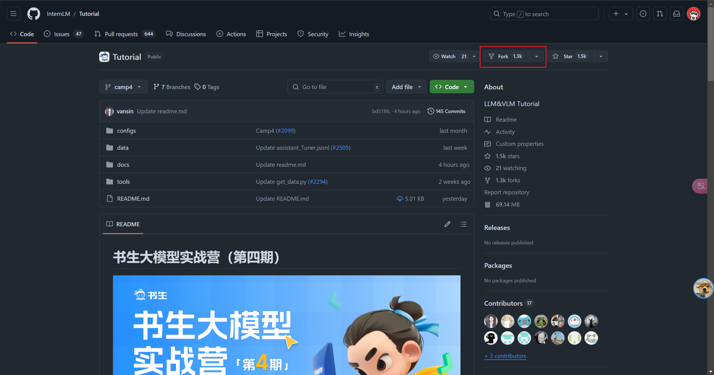

很简单的，点一下我框里面的东东就没问题咯，然后的话一定要记住，下面的√不要打上，这一步就ok了。

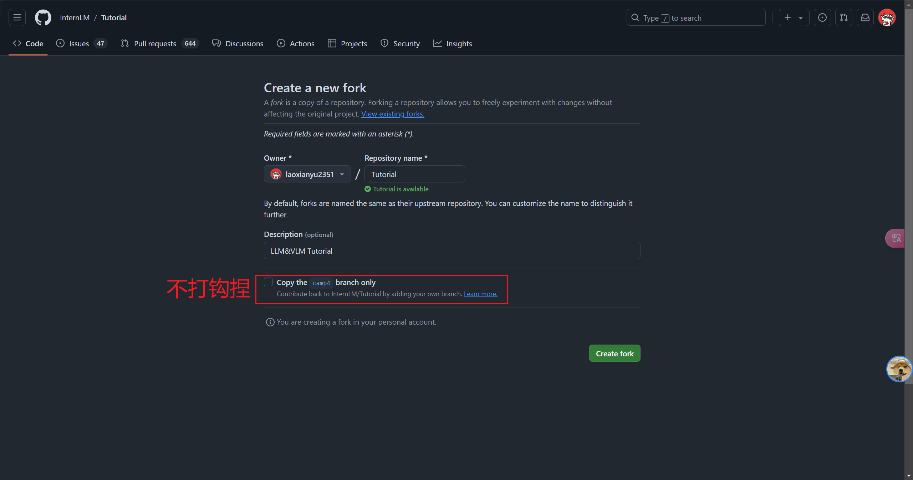

第三步，克隆项目到InternStudio本地

ssh连上远程机器，这个很容易吧，我就不说了（跳过）

接下来输入下面的命令

```
git clone https://github.com/laoxianyu2351/Tutorial.git
# laoxianyu2351这个是我自己的账号哈

```

接下来切换一下分支到class

```
git branch -a

git checkout -b 5464 origin/class
```

然后按照给的模板修改一下就是自己的自我介绍了

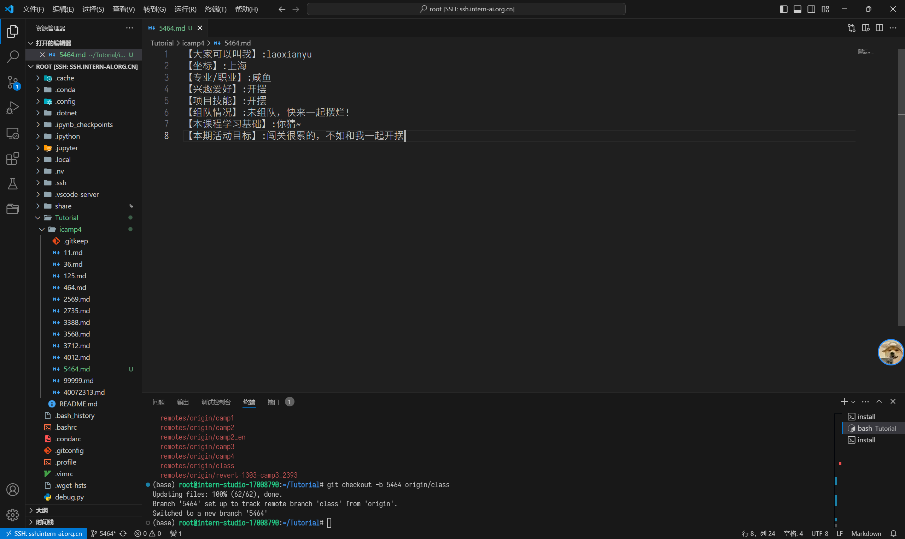

修改好后，我们的任务就是放入暂存区，然后放进本地仓库，最后上传到我们的远程仓库就完事了。

三部曲走起。

```
git add .

git commit -m "add 5464"

git push origin 5364
```

后面跳出来一个界面弹窗，需要登录Github

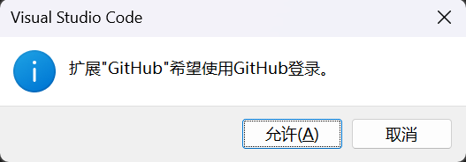

允许后就是了，后面还会跳出一个浏览器弹窗，反正也是允许。这些就说明是没有啥问题了

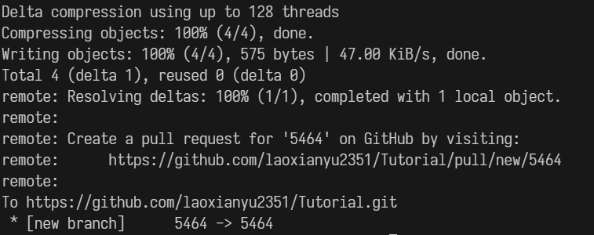

接下来进浏览器，在pullrequest里面看看

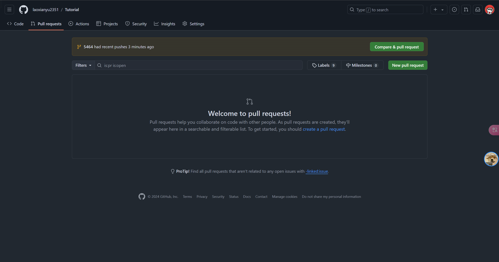

这里改一下，也是按要求，早知道就之前改掉了……我还奇怪为啥前面要填这个，没看明白，原来是这里的要求啊，强烈建议教程前面明确说明commit部分内容是不要自己乱填（我踩坑了

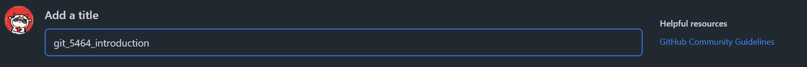

最后create pull request就好了

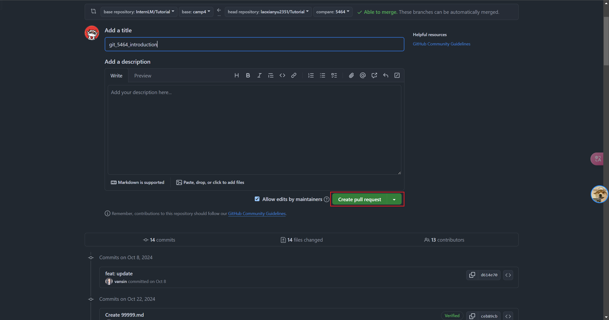

## 任务2：创建并提交一个项目。

俺这边没有啥大模型的相关项目诶，有的话，那就是我自己现在的这个作业仓库！

老师，那我就把这些个作业作为笔记仓库提交了（

第一步，得先初始化捏（我已经安装好了git了，没安装的孩子先安装一下）

```
git init
```

在本地的电脑初始化一下我们的git


然后我这个文件夹的内容是这样的，每个文件夹里面也没啥，都是readme.md（我之前交的作业，你猜猜为什么我不愿意用git，因为用不太来嘻嘻）

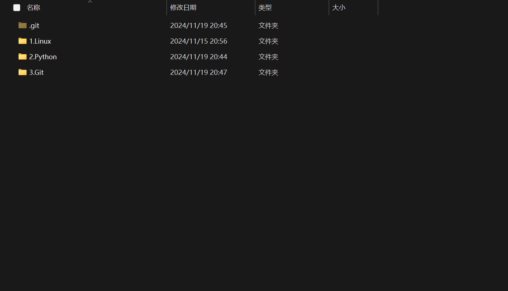

然后我忽然想起来远程的仓库还没有建，搞一个。我们这里new一个新的仓库

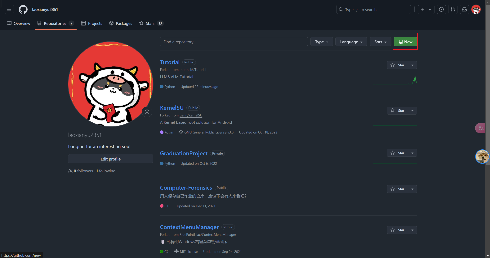

接下来填上名字，我习惯性这样，两个仓库一样的名字完事

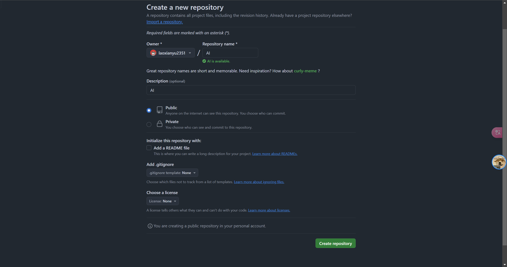

远程创建完毕~

回到本地，我这是第一次创建，很多作业都要提交，很多东西也都是，那么一次性提交得了。使用下面的命令

```

```
