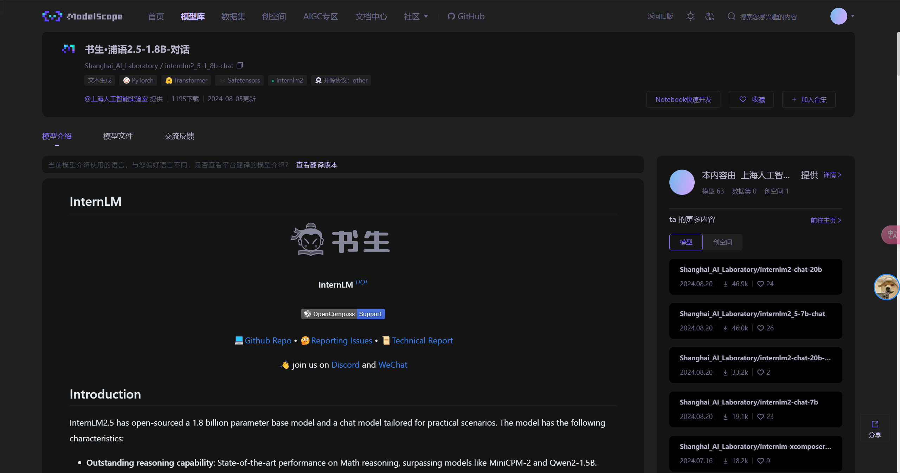
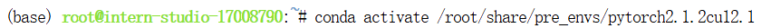
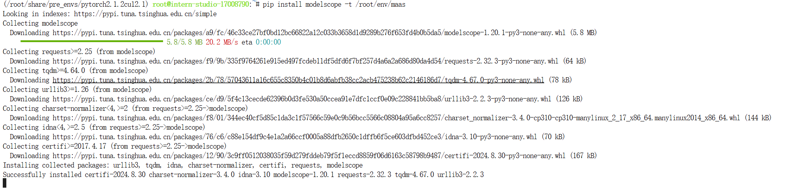
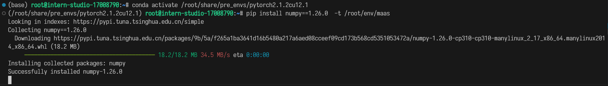
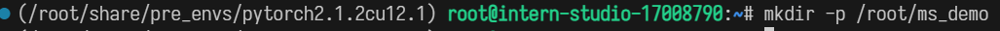

# Mass

## 模型下载

这里选择了魔搭社区平台，因为前面的HF实在是没办法登录（我已经魔法了）

第一步注册，网址在这里

```
https://www.modelscope.cn/home

```
注册应该是很简单的，所以我也就是简单说一下，点击加入社区（或者右上角有一个注册）


注册完成后进入搜索`internlm2_5-chat-1_8b`即可。当然这里要选择官方的模型了



接下来转到开发机这一边。

我们需要先配置一下环境。

就按照要求的，输入命令就行。

```
# 激活环境
conda activate /root/share/pre_envs/pytorch2.1.2cu12.1

# 安装 modelscope
pip install modelscope -t /root/env/maas
pip install numpy==1.26.0  -t /root/env/maas
pip install packaging -t /root/env/maas
```

**当前终端上可以输入命令了，这里可以直接粘贴以下命令。最好一行一行粘贴等每个命令跑完之后再粘贴下一行**（这是文档的原话）




下面这几句话使用来给我们的bash指明当前的环境路径的，所以换一个新bash就要输入一次。

```
export PATH=$PATH:/root/env/maas/bin
export PYTHONPATH=/root/env/maas:$PYTHONPATH
```
然后创建一下`ms_demo`文件夹，我们后面用它放大模型文件



