# 任务 观看「本关卡视频」和「[官网](https://internlm.intern-ai.org.cn/)」、「[GitHub([https://github.com/internLM/](https://github.com/internLM/))」 写一篇关于书生大模型全链路开源开放体系的笔记发布到知乎、CSDN等任一社交媒体

今天的任务主要还是观看视频，写一下笔记。

## AI总结

本次课程深入介绍了书生·浦语（Informer）大模型的开源开放体系及其发展历程。

- **技术亮点**：涵盖从数据采集、模型训练到实际应用场景的全流程解决方案，并实现了显著性能提升及创新功能突破。例如，最新版Informer LM 2.5拥有卓越的推理能力和长达百万级别的上下文容量，在某些指标上甚至超过同类开源模型。
- **核心优势**：强调高性能模型的全面覆盖，从小规模至大规模均适用；同时推出了一系列配套工具，诸如高效的微调框架、自动标签系统Label LLM等，极大简化开发者的工作流。
- **应用前景**：不仅限于基础研究领域，还积极拓展到了具体业务场景的应用探索，特别是Mind Search智能搜索平台展示了利用大型语言模型进行复杂查询的独特潜力。
- **社区建设**：重点阐述了围绕Informer LM建立的庞大生态系统，涵盖了丰富的数据资源、多样化的培训框架和详尽的测试标准，确保每个参与者都能从中受益并贡献自身力量。

## 手动笔记

其实用一句话总结一下视频，就是简单介绍了一下书生·浦语的发展历史和现在那些开源的工具的功能和特性。

书生·浦语的发展历程

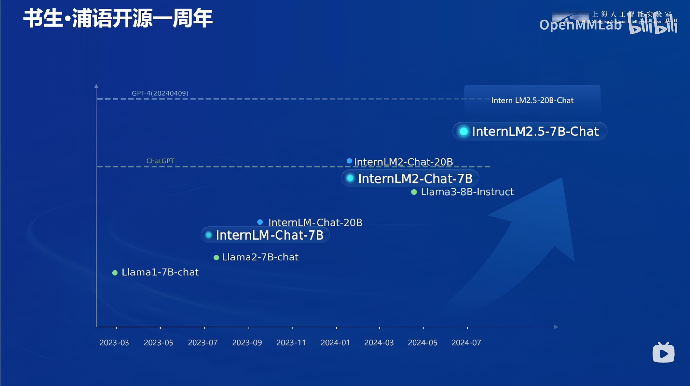

模型训练、提升的简单过程：

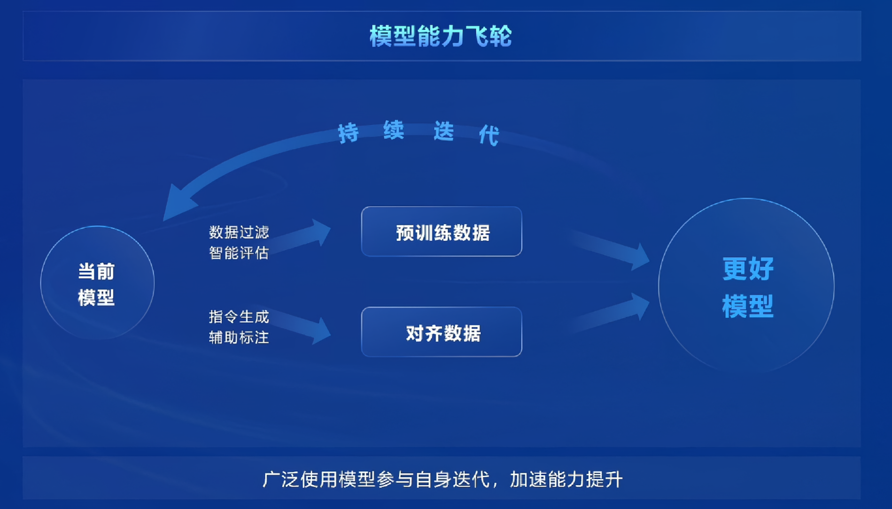

最新的模型拥有非常强大的上下文记忆能力，大海捞针实验（给予非常长的背景知识，随后要求模型提供对应任意在文章中的信息）效果：

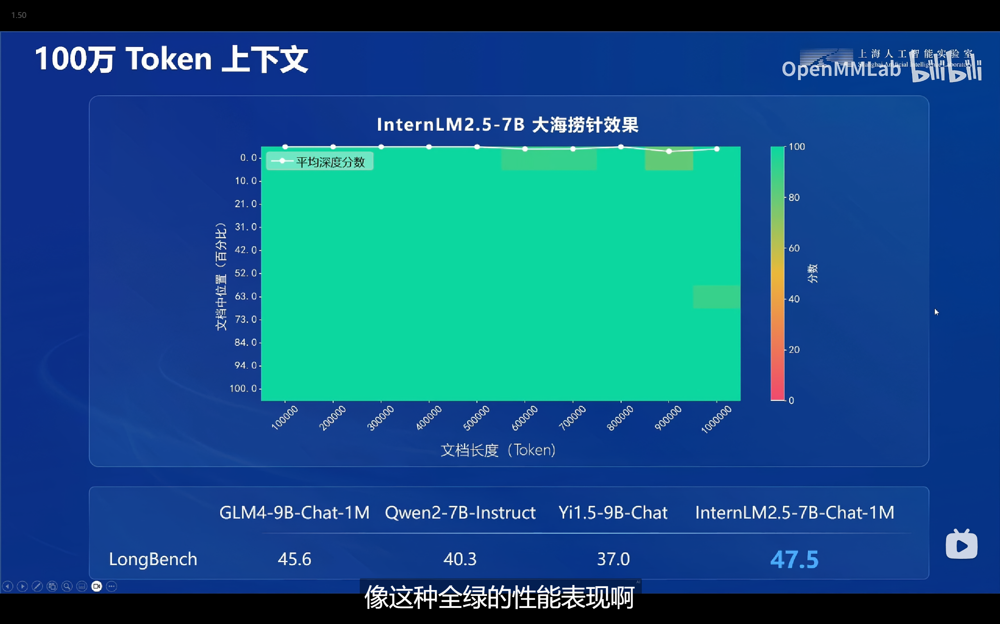

大模型模拟人的思路去解决问题：

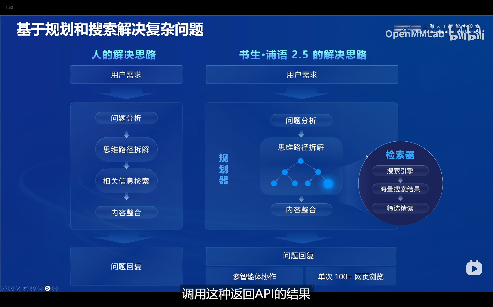

全链路开源

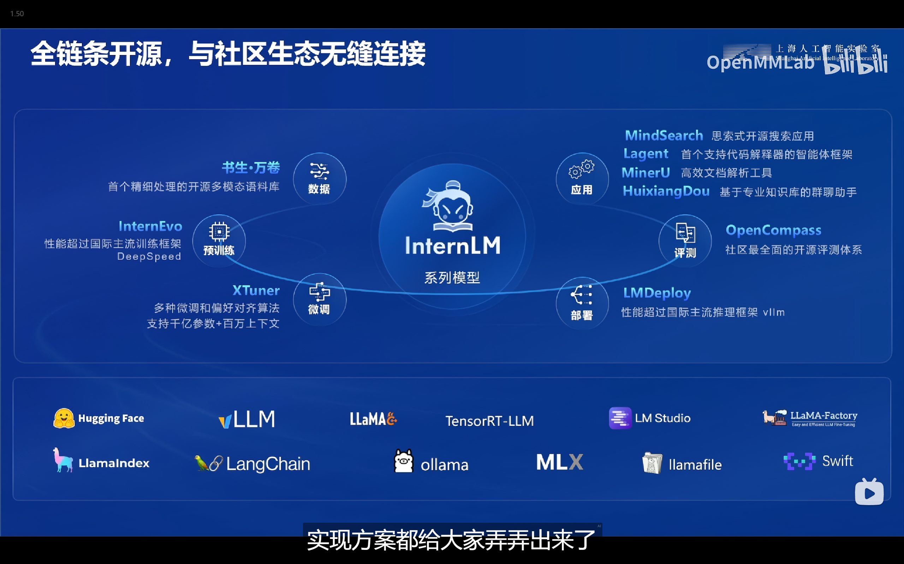

一些数据处理的工具

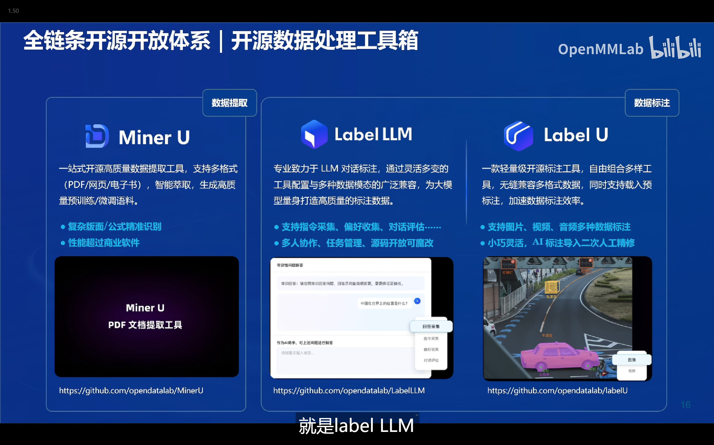

预训练（降低训练成本）

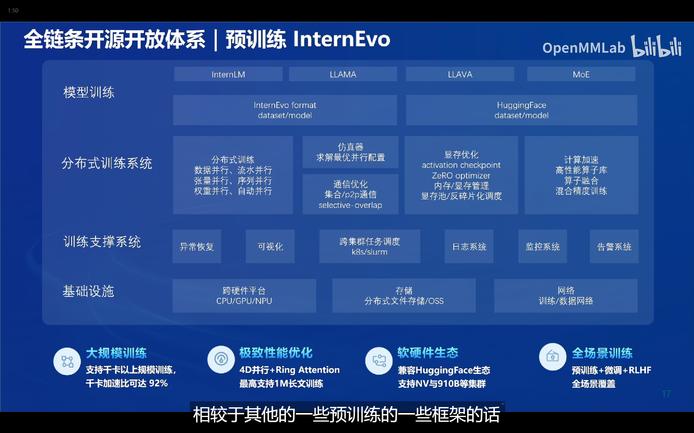

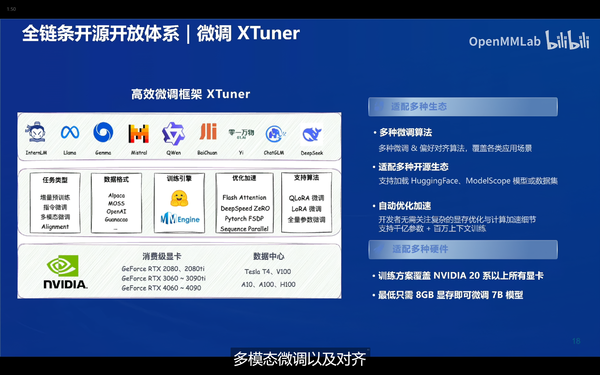

智能体框架

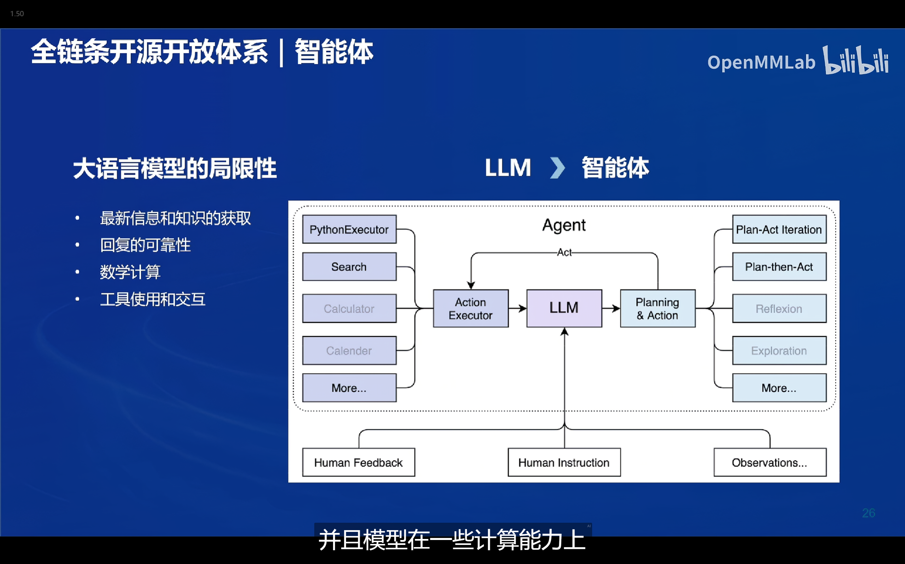

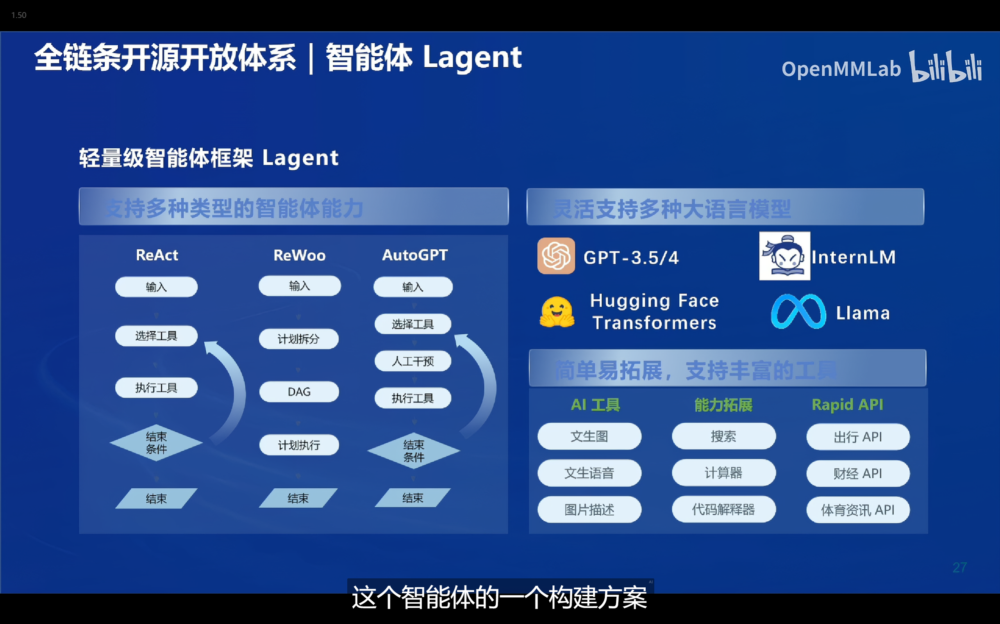

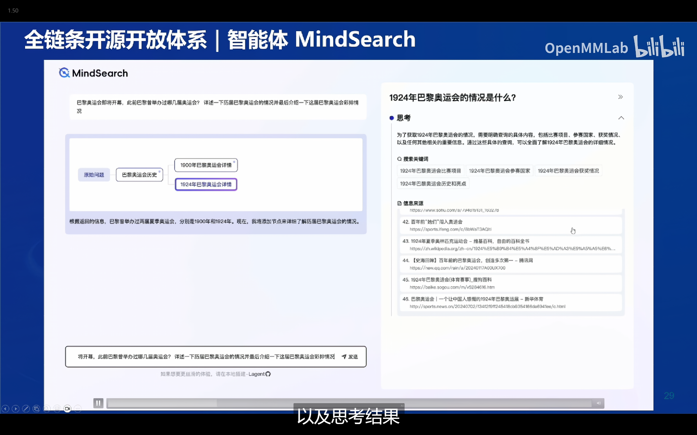
