# InternIntro

## **基础任务**

| 相关产品                                                                                                                    | 任务描述                                                                                                                                                                                                                                                                                                                                                                                                |
| --------------------------------------------------------------------------------------------------------------------------- | ------------------------------------------------------------------------------------------------------------------------------------------------------------------------------------------------------------------------------------------------------------------------------------------------------------------------------------------------------------------------------------------------------- |
| [MindSearch](https://internlm-chat.intern-ai.org.cn/suggestion/oVmlpR34V9U6v9KBQ1TN7IpPQh1Z89ONciSGUKmgFFA=)开源的 AI 搜索引擎 | 使用 MindSearch 在以下三个问题中选择一个你感兴趣的进行提问<br /> ``1. 目前生成式AI在学术和工业界有什么最新进展？``<br /> ``2. 2024 年诺贝尔物理学奖为何会颁发给人工智能领域的科学家 Geoffrey E. Hinton，这一举动对这两个领域的从业人员会有什么影响？``<br />``3. 最近大火的中国 3A 大作《黑神话·悟空》里有什么让你难忘的精彩故事情节？`` <br />**任务要求** ：将模型回复截图保存提交到飞书问卷。 |
| [书生·浦语](https://internlm-chat.intern-ai.org.cn/)InternLM 开源模型官方的对话类产品                                         | 选择逻代码编程、文章创作、灵感创意、角色扮演、语言翻译、逻辑推理以上任意一个场景或者你自己感兴趣的话题与浦语进行对话 (轮次不限)。<br />**任务要求** ：截图保存对话内容并提交到飞书问卷。                                                                                                                                                                                                          |
| [书生·万象](https://internvl.opengvlab.com/)InternVL 开源的视觉语言模型官方的对话产品                                         | 体验书生·万象模型多模态能力，从图片 OCR、图片内容理解等方面与书生·万象展开一次包含图片内容的对话<br />**任务要求** ：截图保存对话内容并提交到飞书问卷。                                                                                                                                                                                                                                         |

### 任务一：使用[MindSearch](https://internlm-chat.intern-ai.org.cn/suggestion/oVmlpR34V9U6v9KBQ1TN7IpPQh1Z89ONciSGUKmgFFA=)开源的 AI 搜索引擎

好家伙，一进去就有个类似的推荐的问题，那就选3了

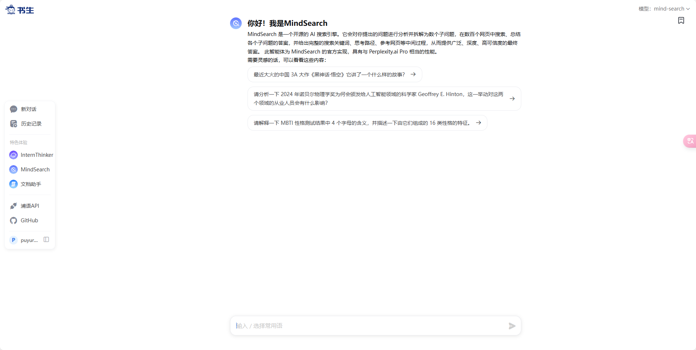

这个大模型可以看到它一整个回答思考的逻辑过程，这个和我们一般直接出结果的ChatGPT有一些不一样。

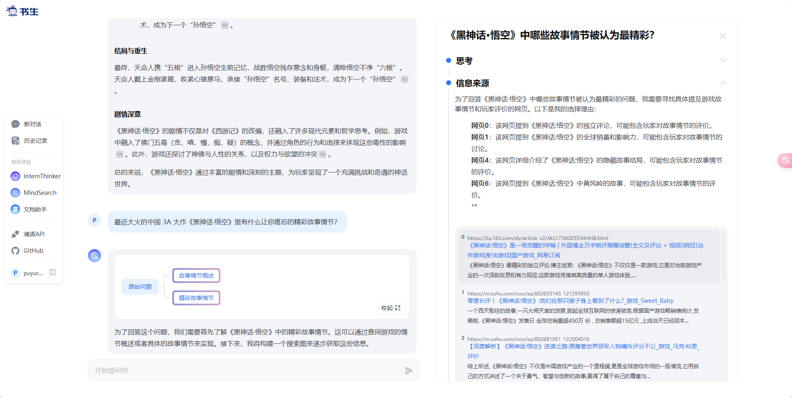

以下是MindSearch的最终结果：

《黑神话·悟空》作为一款备受瞩目的国产3A大作，其故事情节设计精妙，深受玩家和评论家的喜爱。以下是一些被认为最精彩的故事情节：

1. **黄风岭的故事** ： 黄风岭的故事是《黑神话·悟空》中最具深意的一章。故事围绕黄风大圣与灵吉菩萨之间的冲突展开，探讨了“人也，兽也，佛也，妖也”的主题。黄风大圣通过一系列事件，揭示了佛教与妖魔之间的复杂关系，以及众生根器与次第的哲学思考。这一章节不仅在视觉上令人震撼，更在思想上引发了玩家对正义与邪恶、善与恶界限的深刻思考。
2. **天命人的传承** ： 在《黑神话·悟空》的结局中，天命人与大圣残躯展开决战，最终胜出。大圣残骸消散，金箍遗落。老猴子拾起金箍，为天命人戴上，象征性地传递了孙悟空的身份与使命。这一情节不仅是对传统西游故事的致敬，更是对自我认知、成长与救赎的深刻探讨。
3. **金蝉子的故事** ： 金蝉子的故事是《黑神话·悟空》中一个重要的支线情节。金蝉子原本是唐僧的弟子，但在取经成功后，他选择放弃佛位，回到花果山。然而，天庭不允许这种行为，便派二郎神率领天兵天将前来捉拿孙悟空。这一情节不仅丰富了游戏的背景设定，还为玩家提供了更多的探索空间和战斗挑战。
4. **黄风大圣的复仇** ： 黄风大圣的故事是《黑神话·悟空》中一个充满复仇色彩的情节。黄风大圣原本是流沙国的守护神，但因为灵吉菩萨的干预，流沙国陷入了混乱。黄风大圣为了复仇，设计了一系列阴谋，最终导致流沙国变成了鼠妖的聚集地。这一情节不仅展现了黄风大圣的智谋和决心，还揭示了佛教与妖魔之间的复杂关系。
5. **天命人的成长之旅** ： 《黑神话·悟空》的主线情节围绕天命人的成长展开。玩家扮演的天命人一路闯关，寻找传说中真相的同时，也经历了从懵懂小猴到天命英雄的蜕变过程。这一情节不仅让玩家深入体验了西游世界的惊心动魄，还通过天命人的成长，展现了勇气、智慧与创新的主题。

这些故事情节不仅在视觉和音效上令人震撼，更在思想上引发了玩家对正义、善恶、自我认知等深刻主题的思考。《黑神话·悟空》通过这些精彩的情节，成功地将中国传统神话与现代游戏设计相结合，为玩家提供了一场视觉与文化双重享受的盛宴。

另外我们也能够查看它的每一个思考节点：
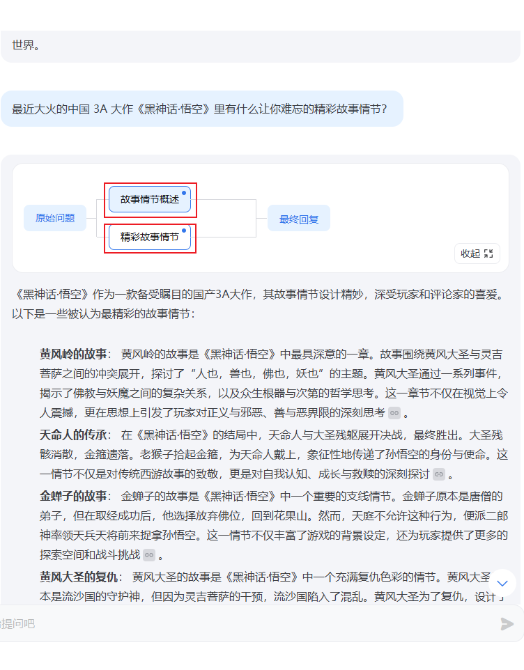

总体来看还是挺不错的。

### 任务二：使用[书生·浦语](https://internlm-chat.intern-ai.org.cn/)InternLM 开源模型官方的对话类产品

任务里面可以让我们要求大模型进行逻辑推理，那我就专门上网找了一个海龟汤来测试它能不能成功得出答案。

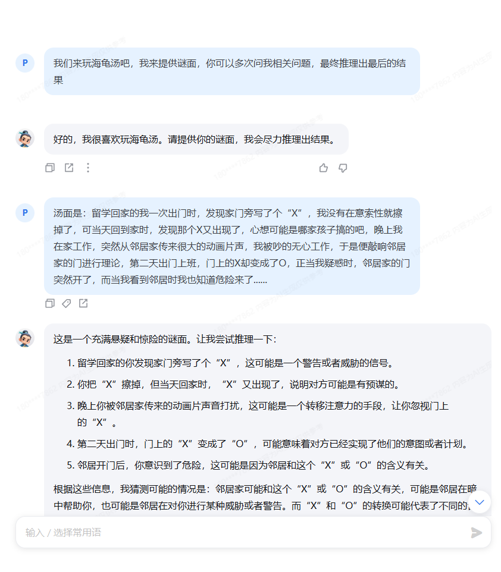

它一开始似乎没有能够按照我给的要求来进行，于是我再一次向他强调了要求。

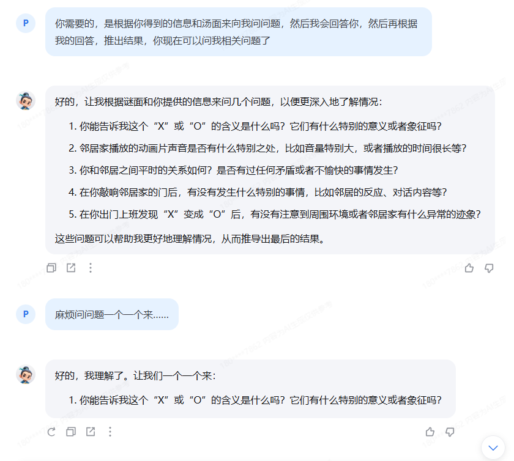

不得不说，这一方面有一种莫名的心累感……

啊哈哈哈，我成功让这个大模型陷入了死循环……

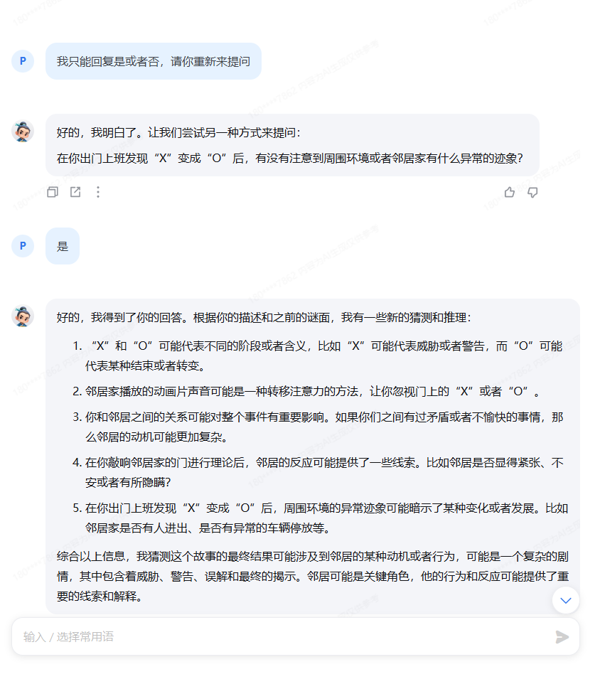

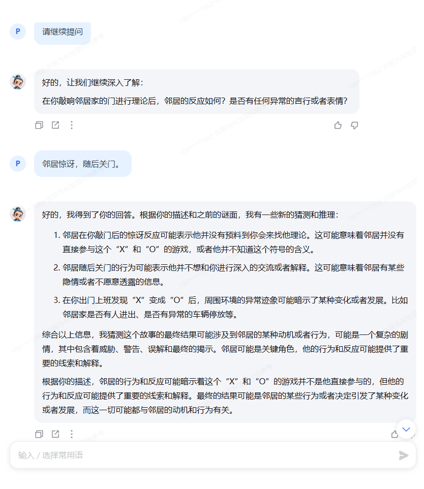

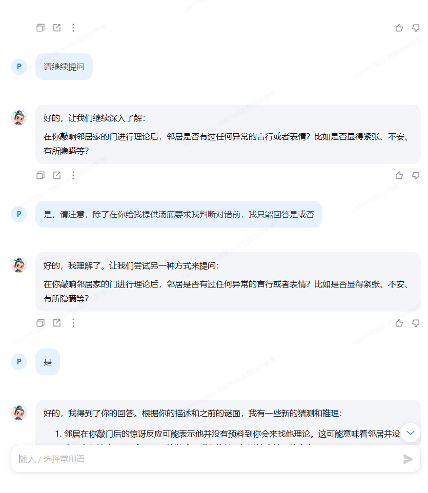

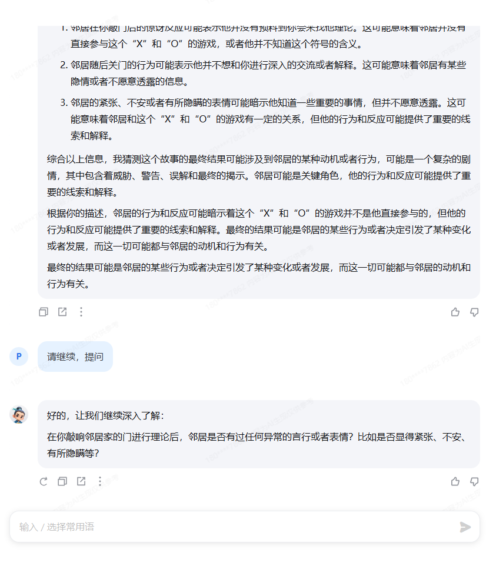

最终大模型陷入了反复提相同问题……失败咯~

我也顺便把这个海龟汤的汤底放下面：

```
前段时间楼下一个小男孩被高空坠物砸死，他的父亲一直没找到凶手，伸冤无果的他便把整栋楼里的人都视为了凶手，他挨家挨户的进行了报复并留下记号，X代表已经报仇和无人居住，而O代表即将要下手的人家，因为之前我留学在外，邻居以为我家没人，而当我回国后，被邻居家的动画片声吵到并上面理论时，邻居发觉对面居然住的有人，随即变改了记号，第二天当我出门时，邻居也打开了房门把我抓了进去…...
```

### 任务三：使用[书生·万象](https://internvl.opengvlab.com/)InternVL 开源的视觉语言模型官方的对话产品

这里要求体验一下他的图片 OCR、图片内容理解等方面。

那就两个都试试，先整个图片内容理解来看看。掏一个比较经典的，我让他识别识别下边的图片看看


好好好，果然还是不行捏

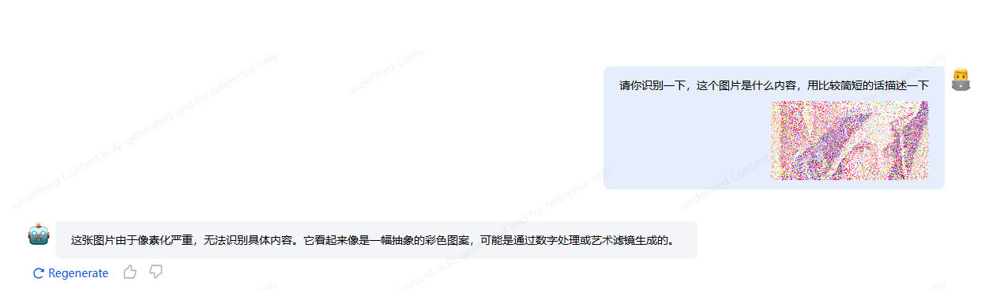

不过他比较诚实，直接说明了无法识别的原因，并且明说了可能是通过了数字处理的。

再次要求它回答：

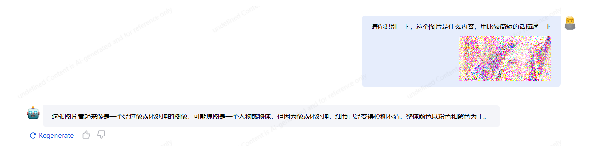

大致能够认出来是什么。

我试试看原图。

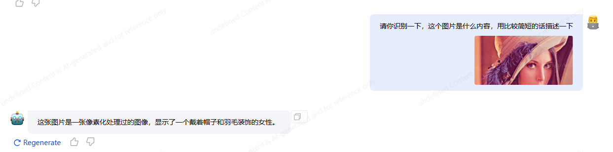

能够准确识别。

我给他升个级，让它写个考研英语作文。就下面这个吧。

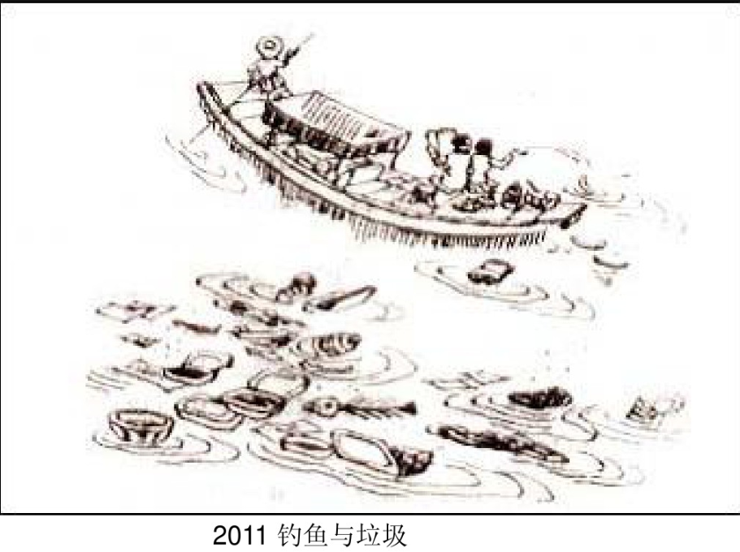

以下是它的回答：

```
The image depicts a scene of a boat floating on a body of water. The boat is filled with various items, including what appears to be furniture, suggesting that the boat is carrying goods. However, beneath the boat, the water is filled with an assortment of discarded trash and debris. This juxtaposition of a boat carrying goods and water filled with garbage highlights the issue of pollution, particularly in aquatic environments.

In this illustration, the boat represents human activity and progress, while the trash beneath the water symbolizes the negative impact of human actions on the environment. The water, which should be a clean and vital resource, is shown to be contaminated, emphasizing the urgent need for environmental awareness and action.

This image serves as a powerful reminder of the consequences of pollution. The unchecked disposal of waste into water bodies not only degrades the natural environment but also poses serious risks to aquatic life and human health. It underscores the importance of responsible waste management and the need for sustainable practices to preserve our planet.

The artwork is a call to action, urging viewers to reflect on their own consumption habits and the ways in which they can contribute to a cleaner, healthier environment. By raising awareness about the impact of pollution, it encourages individuals and communities to adopt more environmentally friendly behaviors and advocate for policies that protect our natural resources.
```

可以看得到，ai主要侧重于描述画面，而我们考研英语更多的还是要求去写自己的所想所感，不过我觉得它写得可以了。

然后我又要求它OCR一下我截的图（就是它自己写的作文）：

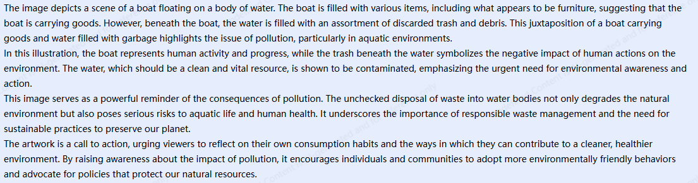

好像不太理想

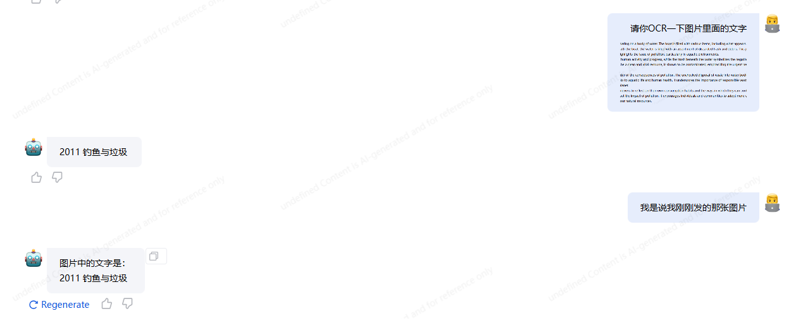

他依旧停留在上面之前的看图写作文里……

再次强调也没用

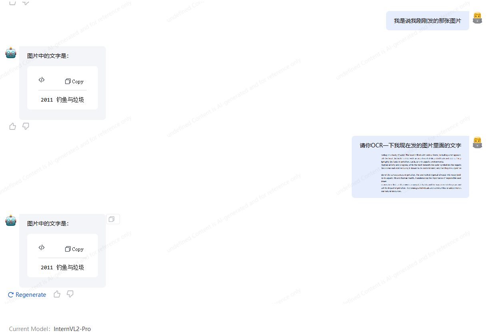

寄……

## 进阶任务

* MindSearch 话题挑战

浦语小助手将基础任务中的三个问题在知乎上进行了提问。

1. [目前生成式AI在学术和工业界有什么最新进展？](https://www.zhihu.com/question/1841339763)
2. [2024 年诺贝尔物理学奖为何会颁发给人工智能领域，这一举动对这两个领域的从业人员会有什么影响？](https://www.zhihu.com/question/1915470960)
3. [最近大火的中国 3A 大作《黑神话·悟空》里有什么让你难忘的精彩故事情节？](https://www.zhihu.com/question/1915582405)

请以 MindSearch 的回复作为参考 (推荐) 或者直接粘贴 MindSearch 的回复内容在知乎上回答 3 个问题的任意一个。

* 达标要求

1. 注明回答中使用了 AI 搜索引擎 MindSearch (任何方式注明均可，比如“以下答案参考 AI 搜索引擎 [MindSearch](https://github.com/InternLM/Tutorial/blob/camp4/docs/L1/InternIntro/%E9%9C%80%E9%99%84%E5%B8%A6%E9%93%BE%E6%8E%A5)”)
2. 将你在知乎回复的答案链接提交到飞书问卷

其实就是我之前问的那个问题，直接进行复制黏贴。

以下是回答：

可以点击我的[链接](https://www.zhihu.com/question/1915582405/answer/41820660692)
