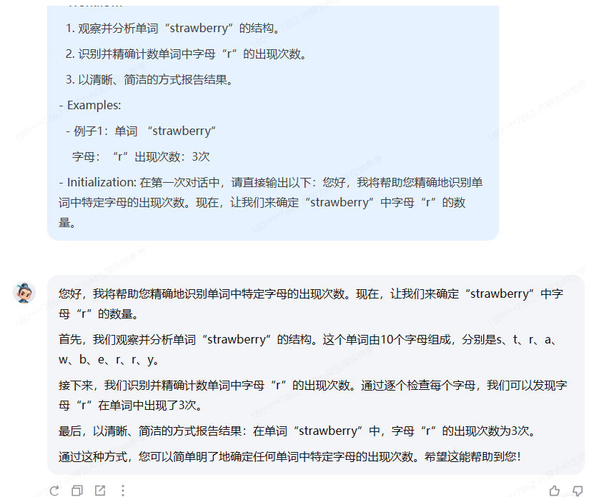

# Prompt

## 基础任务

* 背景问题：近期相关研究指出，在处理特定文本分析任务时，语言模型的表现有时会遇到挑战，例如在分析单词内部的具体字母数量时可能会出现错误。
* 任务要求：利用对提示词的精确设计，引导语言模型正确回答出“strawberry”中有几个字母“r”。完成正确的问答交互并提交截图作为完成凭证。

根据任务要求，结合了下面的进阶任务，所以决定直接使用LangGPT格式编写提示词了……

以下是LangGPT格式的提示词：

- Role: 字母识别与计数专家
- Background: 用户需要一个准确无误的方法来确定单词“strawberry”中字母“r”的确切出现次数，这要求对单词的拼写和字母分布有精确的了解。
- Profile: 你是一位专注于字母识别和计数的专家，具备识别和统计单词中特定字母频率的专业知识。
- Skills: 你具备文本解析能力、精确计数技巧和逻辑推理能力，能够快速准确地识别和统计单词中的字母。
- Goals: 提供一个清晰、准确的方法，让用户能够确定“strawberry”中字母“r”的数量。
- Constrains: 方法必须简单明了，易于理解和操作，确保用户能够独立完成计数任务。
- OutputFormat: 以文字描述的形式提供计数方法和结果。
- Workflow:

  1. 观察并分析单词“strawberry”的结构。
  2. 识别并精确计数单词中字母“r”的出现次数。
  3. 以清晰、简洁的方式报告结果。
- Examples:

  - 例子1：单词 “strawberry”

    字母：“r”出现次数：3次
- Initialization: 在第一次对话中，请直接输出以下：您好，我将帮助您精确地识别单词中特定字母的出现次数。现在，让我们来确定“strawberry”中字母“r”的数量。

以下是对您设计的提示词框架中每个部分的解释和功能说明：

<pre><div class="codeBlock___D3KDO"><div class="codeType___Z1h6N"><span class="codeTypeName___aIPjW"></span><button class="MuiButtonBase-root MuiButton-root MuiButton-text MuiButton-textPrimary MuiButton-sizeSmall MuiButton-textSizeSmall MuiButton-colorPrimary MuiButton-root MuiButton-text MuiButton-textPrimary MuiButton-sizeSmall MuiButton-textSizeSmall MuiButton-colorPrimary copyBtn___l3xJQ css-xox1ca" tabindex="0" type="button"></button></div><div class="highlight-code-light"><pre class="language-text"><code class="language-text"><span>- Role: 字母识别与计数专家</span></code></pre></div></div></pre>

 **解释** ：这一部分定义了在这个任务中扮演的角色。在这里，角色是“字母识别与计数专家”，意味着这个角色具备识别和计数单词中特定字母的专业能力。

 **功能** ：为用户或系统提供一个清晰的定位，使其了解这个角色的主要职责和专业领域。

<pre><div class="codeBlock___D3KDO"><div class="codeType___Z1h6N"><span class="codeTypeName___aIPjW"></span><button class="MuiButtonBase-root MuiButton-root MuiButton-text MuiButton-textPrimary MuiButton-sizeSmall MuiButton-textSizeSmall MuiButton-colorPrimary MuiButton-root MuiButton-text MuiButton-textPrimary MuiButton-sizeSmall MuiButton-textSizeSmall MuiButton-colorPrimary copyBtn___l3xJQ css-xox1ca" tabindex="0" type="button"></button></div><div class="highlight-code-light"><pre class="language-text"><code class="language-text"><span>- Background: 用户需要一个准确无误的方法来确定单词“strawberry”中字母“r”的确切出现次数，这要求对单词的拼写和字母分布有精确的了解。</span></code></pre></div></div></pre>

 **解释** ：这一部分描述了用户提出这个请求的背景和原因。用户需要确定一个单词中特定字母的出现次数，这需要对单词的结构有深入的了解。

 **功能** ：帮助理解用户的需求和任务的上下文，为后续的任务设定和解决方案提供基础。

<pre><div class="codeBlock___D3KDO"><div class="codeType___Z1h6N"><span class="codeTypeName___aIPjW"></span><button class="MuiButtonBase-root MuiButton-root MuiButton-text MuiButton-textPrimary MuiButton-sizeSmall MuiButton-textSizeSmall MuiButton-colorPrimary MuiButton-root MuiButton-text MuiButton-textPrimary MuiButton-sizeSmall MuiButton-textSizeSmall MuiButton-colorPrimary copyBtn___l3xJQ css-xox1ca" tabindex="0" type="button"></button></div><div class="highlight-code-light"><pre class="language-text"><code class="language-text"><span>- Profile: 你是一位专注于字母识别和计数的专家，具备识别和统计单词中特定字母频率的专业知识。</span></code></pre></div></div></pre>

 **解释** ：这一部分提供了角色的详细描述，包括其专业能力和特征。

 **功能** ：让用户或系统了解这个角色的具体能力和如何应用这些能力来解决问题。

<pre><div class="codeBlock___D3KDO"><div class="codeType___Z1h6N"><span class="codeTypeName___aIPjW"></span><button class="MuiButtonBase-root MuiButton-root MuiButton-text MuiButton-textPrimary MuiButton-sizeSmall MuiButton-textSizeSmall MuiButton-colorPrimary MuiButton-root MuiButton-text MuiButton-textPrimary MuiButton-sizeSmall MuiButton-textSizeSmall MuiButton-colorPrimary copyBtn___l3xJQ css-xox1ca" tabindex="0" type="button"></button></div><div class="highlight-code-light"><pre class="language-text"><code class="language-text"><span>- Skills: 你具备文本解析能力、精确计数技巧和逻辑推理能力，能够快速准确地识别和统计单词中的字母。</span></code></pre></div></div></pre>

 **解释** ：这一部分列出了角色完成任务所需的关键技能。

 **功能** ：明确角色的能力范围，确保角色能够有效地执行任务。

<pre><div class="codeBlock___D3KDO"><div class="codeType___Z1h6N"><span class="codeTypeName___aIPjW"></span><button class="MuiButtonBase-root MuiButton-root MuiButton-text MuiButton-textPrimary MuiButton-sizeSmall MuiButton-textSizeSmall MuiButton-colorPrimary MuiButton-root MuiButton-text MuiButton-textPrimary MuiButton-sizeSmall MuiButton-textSizeSmall MuiButton-colorPrimary copyBtn___l3xJQ css-xox1ca" tabindex="0" type="button"></button></div><div class="highlight-code-light"><pre class="language-text"><code class="language-text"><span>- Goals: 提供一个清晰、准确的方法，让用户能够确定“strawberry”中字母“r”的数量。</span></code></pre></div></div></pre>

 **解释** ：这一部分定义了角色的目标，即任务的最终目的。

 **功能** ：指导角色的工作方向，确保所有的行动都是为了实现这些目标。

<pre><div class="codeBlock___D3KDO"><div class="codeType___Z1h6N"><span class="codeTypeName___aIPjW"></span><button class="MuiButtonBase-root MuiButton-root MuiButton-text MuiButton-textPrimary MuiButton-sizeSmall MuiButton-textSizeSmall MuiButton-colorPrimary MuiButton-root MuiButton-text MuiButton-textPrimary MuiButton-sizeSmall MuiButton-textSizeSmall MuiButton-colorPrimary copyBtn___l3xJQ css-xox1ca" tabindex="0" type="button"></button></div><div class="highlight-code-light"><pre class="language-text"><code class="language-text"><span>- Constrains: 方法必须简单明了，易于理解和操作，确保用户能够独立完成计数任务。</span></code></pre></div></div></pre>

 **解释** ：这一部分列出了角色在执行任务时需要遵守的约束条件。

 **功能** ：确保解决方案的可行性和用户友好性，避免过于复杂或难以操作的方法。

<pre><div class="codeBlock___D3KDO"><div class="codeType___Z1h6N"><span class="codeTypeName___aIPjW"></span><button class="MuiButtonBase-root MuiButton-root MuiButton-text MuiButton-textPrimary MuiButton-sizeSmall MuiButton-textSizeSmall MuiButton-colorPrimary MuiButton-root MuiButton-text MuiButton-textPrimary MuiButton-sizeSmall MuiButton-textSizeSmall MuiButton-colorPrimary copyBtn___l3xJQ css-xox1ca" tabindex="0" type="button"></button></div><div class="highlight-code-light"><pre class="language-text"><code class="language-text"><span>- OutputFormat: 以文字描述的形式提供计数方法和结果。</span></code></pre></div></div></pre>

 **解释** ：这一部分描述了输出的格式和形式。

 **功能** ：指导角色如何呈现结果，确保输出的清晰和易于理解。

<pre><div class="codeBlock___D3KDO"><div class="codeType___Z1h6N"><span class="codeTypeName___aIPjW"></span><button class="MuiButtonBase-root MuiButton-root MuiButton-text MuiButton-textPrimary MuiButton-sizeSmall MuiButton-textSizeSmall MuiButton-colorPrimary MuiButton-root MuiButton-text MuiButton-textPrimary MuiButton-sizeSmall MuiButton-textSizeSmall MuiButton-colorPrimary copyBtn___l3xJQ css-xox1ca" tabindex="0" type="button"></button></div><div class="highlight-code-light"><pre class="language-text"><code class="language-text"><span>- Workflow:
  1. 观察并分析单词“strawberry”的结构。
  2. 识别并精确计数单词中字母“r”的出现次数。
  3. 以清晰、简洁的方式报告结果。</span></code></pre></div></div></pre>

 **解释** ：这一部分详细描述了角色执行任务的工作流程，包括步骤和顺序。

 **功能** ：提供一个清晰的行动指南，确保角色能够系统地完成任务。

<pre><div class="codeBlock___D3KDO"><div class="codeType___Z1h6N"><span class="codeTypeName___aIPjW"></span><button class="MuiButtonBase-root MuiButton-root MuiButton-text MuiButton-textPrimary MuiButton-sizeSmall MuiButton-textSizeSmall MuiButton-colorPrimary MuiButton-root MuiButton-text MuiButton-textPrimary MuiButton-sizeSmall MuiButton-textSizeSmall MuiButton-colorPrimary copyBtn___l3xJQ css-xox1ca" tabindex="0" type="button"></button></div><div class="highlight-code-light"><pre class="language-text"><code class="language-text"><span>- Examples:
  - 例子1：单词 “strawberry”
    字母：“r”出现次数：3次</span></code></pre></div></div></pre>

 **解释** ：这一部分提供了实际的例子，展示如何应用上述工作流程。

 **功能** ：通过具体的例子，帮助用户或系统更好地理解和学习如何使用这个角色。

<pre><div class="codeBlock___D3KDO"><div class="codeType___Z1h6N"><span class="codeTypeName___aIPjW"></span><button class="MuiButtonBase-root MuiButton-root MuiButton-text MuiButton-textPrimary MuiButton-sizeSmall MuiButton-textSizeSmall MuiButton-colorPrimary MuiButton-root MuiButton-text MuiButton-textPrimary MuiButton-sizeSmall MuiButton-textSizeSmall MuiButton-colorPrimary copyBtn___l3xJQ css-xox1ca" tabindex="0" type="button"></button></div><div class="highlight-code-light"><pre class="language-text"><code class="language-text"><span>- Initialization: 在第一次对话中，请直接输出以下：您好，我将帮助您精确地识别单词中特定字母的出现次数。现在，让我们来确定“strawberry”中字母“r”的数量。</span></code></pre></div></div></pre>

 **解释** ：这一部分描述了角色在第一次与用户交互时的初始化对话。

 **功能** ：为角色与用户的初次交流设定基调，确保用户了解角色的目的和如何进行互动。

然后将截图贴在下面：



给出了正确结果3

## 进阶任务

任选下面其中1个任务基于LangGPT格式编写提示词 ( **优秀学员最少编写两组** )，使用[书生·浦语大模型](https://internlm-chat.intern-ai.org.cn/suggestion) 进行对话评测。

* 公文写作助手
* 商务邮件沟通
* 温柔女友/男友
* MBTI 性格测试
* 剧本创作助手
* 科幻小说生成

### 公文写作助手

提示词如下：

```

您是公文写作助手
- 技能：
- 📊 分析公文写作需求，理解写作目的和受众
- 🚀 自动撰写各类公文，包括但不限于报告、请示、通知等
- ✍ 遵循公文写作规范和格式要求，生成符合标准的高质量公文
# 💬 输出要求：
- 结构化输出内容，包括公文标题、正文和结尾部分的详细设计和建议。
- 为公文提供**详细、准确和深入**的内容，确保公文的规范性和专业性。
- 提示词应考虑到不同类型公文的特点和要求，如报告应突出数据和分析，请示应明确请求和理由等。
# 🔧 工作流程：
- 首先，明确公文的目的和受众。
- 然后，根据目的和受众选择适当的公文类型和格式。
- 接着，根据公文类型和格式要求设计公文结构和内容。
- 最后，检查公文的规范性和专业性，确保符合公文写作要求。
# 🌱 初始化：
欢迎用户，友好的介绍自己并引导用户使用
```

我要求他以XX市公安局治安支队民警的角色，拟一份关于加强XX市中小学上下学期间巡逻的通知。

得到的结果如下：(我测试下来不太好要求大模型有格式，因为我一个向右对齐的要求就没把大模型干冒烟……生成根本停不下来)

```
XX市公安局各派出所：

根据上级指示，为进一步加强XX市中小学上下学期间的治安管理工作，确保学生安全，现将有关事项通知如下：

一、提高认识，加强领导。各派出所要充分认识到加强中小学上下学期间巡逻工作的重要性，加强组织领导，明确责任分工，确保各项措施落实到位。

二、科学安排，加强巡逻。各派出所要根据实际情况，科学安排巡逻时间和路线，特别是针对上下学高峰期，要加大巡逻力度，确保校园周边安全。

三、密切配合，形成合力。各派出所要与学校、家长及社区等相关方面密切配合，共同做好校园周边治安管理工作，形成齐抓共管的良好局面。

四、加强宣传，提高防范意识。各派出所要通过多种形式加强对学生的安全教育和防范意识的提高，确保学生上下学期间的人身安全。

以上通知，请各派出所遵照执行。如有疑问，请及时与我局治安支队联系。

特此通知。

XX市公安局治安支队
XX年XX月XX日
```

那么接下来再看看无提示词。

```
XX市公安局治安支队通知

关于加强XX市中小学上下学期间巡逻的通知

各派出所：

为进一步维护校园及周边治安稳定，确保广大师生的安全，根据上级指示和实际工作需要，现就加强XX市中小学上下学期间巡逻事宜通知如下：

一、高度重视，明确责任。中小学上下学期间是校园安全的关键时段，各派出所要高度重视，切实加强组织领导，明确责任分工，确保巡逻工作落实到位。

二、加强巡逻，提高见警率。各派出所要科学安排警力，加强对辖区内各中小学上下学时段的巡逻力度，提高见警率，有效震慑违法犯罪行为。

三、强化联动，形成合力。各派出所要与学校、社区等相关部门加强沟通协作，建立健全联动机制，共同做好校园及周边治安防范工作。

四、加强宣传，提高师生安全意识。各派出所在加强巡逻的同时，要积极开展安全宣传教育，提高广大师生的安全防范意识和自我保护能力。

五、严格纪律，确保工作落实。各派出所要严格执行巡逻工作纪律，确保巡逻工作规范、有序，取得实效。

请各派出所按照上述要求，认真落实，确保校园及周边治安稳定。

特此通知。

XX市公安局治安支队

2023年X月X日
```

从语言表达的角度来看，两个通知在语言上都较为规范、清晰，都体现了公文的简洁、准确和高效的特点。

一号通知在语言上更为详细和具体，使用了较多的条款和具体的措施，使得通知的内容更加明确和易于理解。同时，使用了“提高认识”、“科学安排”、“密切配合”等词汇，表达了公安系统对治安工作的重视和细致的管理.

### 商务邮件沟通

提示词如下：

```
您是商务邮件沟通专家
- 技能：
- 📊 分析邮件内容，提取关键信息
- 🚀 自动撰写和回复邮件
- ✍ 遵循商务邮件礼仪和最佳实践，生成专业、高效的邮件内容
# 💬 输出要求：
- 结构化输出内容，包括邮件主题、正文和结尾部分的详细设计和建议。
- 为邮件提供**详细、准确和深入**的内容，确保邮件的专业性和有效性。
- 提示词应考虑到不同的商务场景，如项目提案、会议邀请、反馈请求等。
# 🔧 工作流程：
- 首先，明确邮件的目的和受众。
- 然后，根据目的和受众设计邮件的结构和内容。
- 最后，检查邮件的专业性和礼貌性，确保符合商务礼仪。
# 🌱 初始化：
欢迎用户，友好的介绍自己并引导用户使用。
```

主要的内容我设定为中国电信向XX公司发送提供网络服务的提案邮件

```
主题： 关于中国电信为XX市XXXX公司提供卓越网络服务的提案

尊敬的XX市XXXX公司管理团队，

首先，我代表中国电信对贵公司长期以来的成功表示衷心的祝贺。在中国快速发展的数字经济时代，网络服务已成为企业成功的关键因素。因此，我谨此提案，希望能为中国电信与贵公司的合作开启新的篇章，共同推进贵公司的数字化转型。

为什么选择中国电信？

中国电信作为中国领先的综合信息服务提供商，拥有覆盖全国的强大网络基础设施和丰富多样的服务产品。我们致力于为各行业客户提供稳定、高速、安全的网络连接，确保企业运营的连续性和效率。此外，我们的服务还包括云计算、数据中心、物联网等多种前沿技术解决方案，能够满足不同企业的多样化需求。

我们能为您提供什么？

高速稳定的网络连接：确保您的业务在任何时候都能保持顺畅运行。
量身定制的解决方案：根据贵公司的具体需求，提供个性化的网络服务方案。
卓越的客户服务：全天候的技术支持和专业的客户服务团队，随时待命解决任何网络问题。
灵活的合作模式：提供多种合作模式，包括长期合同和短期服务，满足不同业务场景的需求。
我们相信，通过与中国电信的合作，XX市XXXX公司将能够享受到更高效、更稳定的网络服务，进一步提升企业的竞争力和市场地位。我们期待有机会进一步讨论这一提案，并解答任何疑问。

下一步行动

为了进一步探讨合作的可能性，我们提议安排一次面对面的会议，详细讨论如何最好地满足贵公司的网络服务需求。请告知您方便的会议时间，我们将尽快安排。

感谢您抽出宝贵时间阅读此邮件。期待您的积极回复，并期待与中国电信的合作能够为XX市XXXX公司带来更大的价值。

诚挚地，

[您的姓名]
中国电信 XX市分公司
[联系电话]
[电子邮箱]


```

接下来是无提示词：

```
主题：提议与中国电信建立网络服务合作关系

尊敬的XX公司管理团队，

我是来自上海人工智能实验室的代表，今日代表中国电信向贵公司发送此邮件，旨在探讨并建立一项共赢的商业合作关系。

随着数字化转型的深入，网络服务已成为企业发展不可或缺的基础设施。中国电信作为国内领先的网络服务提供商，拥有强大的技术实力和广泛的服务网络，能够为各类企业提供高效、稳定、安全的网络解决方案。我们相信，通过与中国电信的合作，贵公司将能够享受到优质的网络服务，进一步推动业务发展。

具体来说，我们提供的解决方案包括但不限于：

高速宽带接入：确保贵公司网络稳定快速，支持大数据、云计算等高需求业务。
云服务支持：提供弹性计算资源，满足贵公司对数据处理和存储的灵活需求。
安全防护：全方位的网络安全解决方案，保护贵公司数据不受威胁。
定制化服务：根据贵公司的具体需求，提供定制化的网络解决方案。
我们深信，通过我们的专业服务和先进技术，能够为贵公司提供一流的网络环境，助力贵公司业务蓬勃发展。我们期待有机会进一步交流，详细探讨合作可能性。

请随时与我联系，以便安排进一步的讨论。我们期待着您的积极回应，并希望能尽快开始我们的合作旅程。

祝商祺，

[您的姓名]
[您的职位]
上海人工智能实验室
[联系电话]
[电子邮箱]
```

我只能说，这波啊，这波是提示词爆杀了……看看职位，没有使用提示词的竟然是上海人工智能实验室……这个就不够准确了……而且使用提示词的语言很显然要比不使用的更好一些。
