# Llamaindex

## 基础任务

### 任务要求1：基于 LlamaIndex 构建自己的 RAG 知识库，寻找一个问题 A 在使用 LlamaIndex 之前 浦语 API 不会回答，借助 LlamaIndex 后 浦语 API 具备回答 A 的能力，截图保存。

教程第一步就是提升配置，不过人家是直接开的新开发机，我这儿选择提升配置……

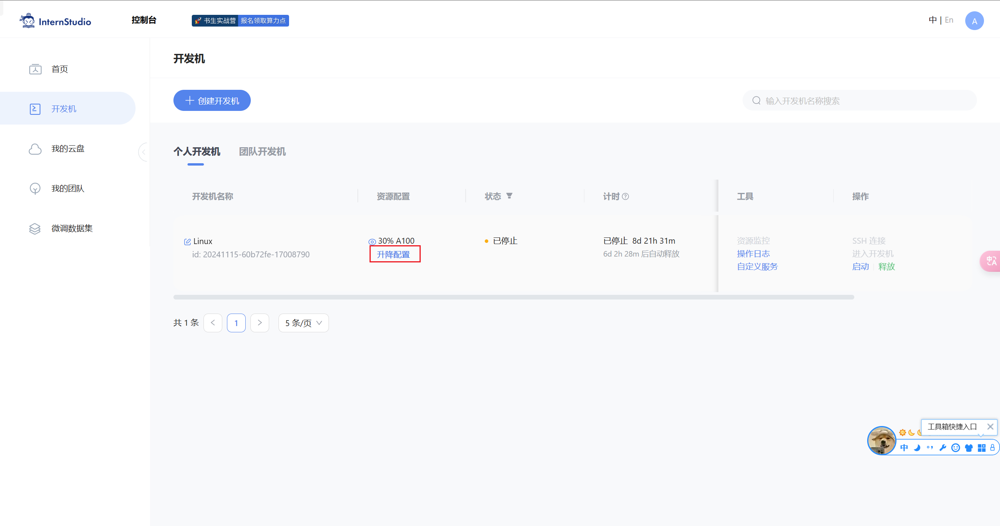

然后教程是给的创建一个新的虚拟python环境，俺也依葫芦画瓢搞一个。(我选择在web中用终端……VScode的ssh输入命令不知道为什么特别卡……)

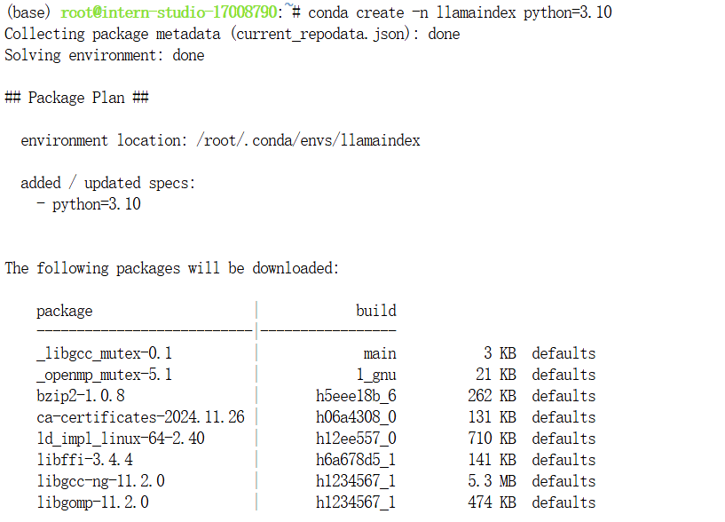

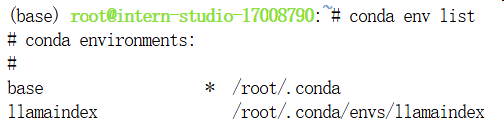

接下来激活虚拟环境，并且安装相关依赖和后面要用到的库。

```
# 激活虚拟环境
conda activate llamaindex

# 安装依赖和库
pip install einops==0.7.0 protobuf==5.26.1
pip install llama-index==0.11.20
pip install llama-index-llms-replicate==0.3.0
pip install llama-index-llms-openai-like==0.2.0
pip install llama-index-embeddings-huggingface==0.3.1
pip install llama-index-embeddings-instructor==0.2.1
pip install torch==2.5.0 torchvision==0.20.0 torchaudio==2.5.0 --index-url https://download.pytorch.org/whl/cu121
```

随后进入根目录，开个文件夹，放我们的模型

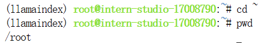

然后和教程的一样，进入目录，设置好下载的脚本

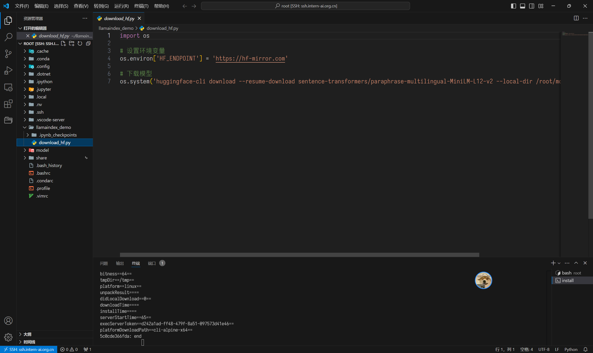

在激活了虚拟环境的情况下，直接运行，开始下载

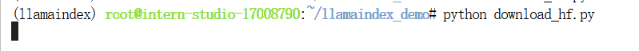

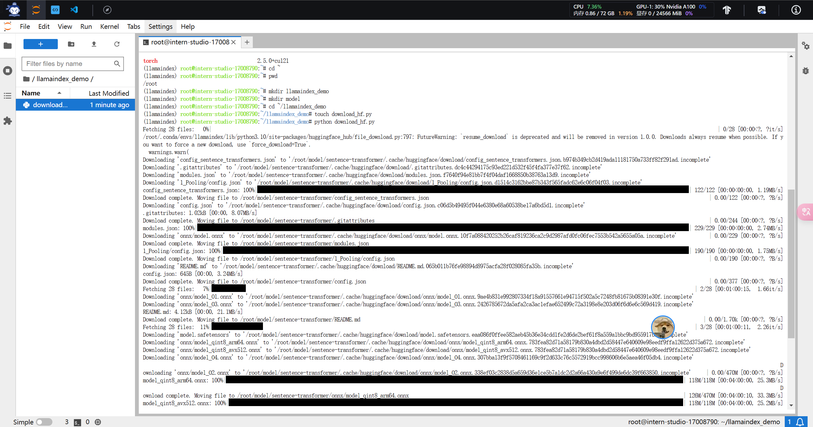

稍微耐心等待一下。

好了之后按照教程，咱们下一下模型。

```
# 不用这个的话可能之前没有安装过这个，导致后面的命令不认……
apt install git-lfs 

git lfs install

cd /root/model/

git clone https://www.modelscope.cn/Ceceliachenen/paraphrase-multilingual-MiniLM-L12-v2.git

mv paraphrase-multilingual-MiniLM-L12-v2 sentence-transformer
```

可以看到图片里这样，就是把要的东西下载好了……

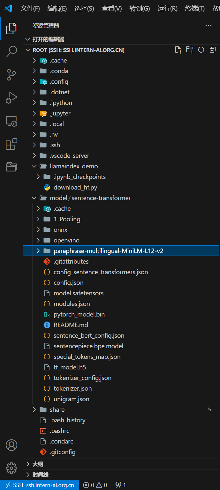

为了避免网络问题，这里再下载一下NLTK的相关资源。

```
cd /root
git clone https://gitee.com/yzy0612/nltk_data.git  --branch gh-pages
cd nltk_data
mv packages/*  ./
cd tokenizers
unzip punkt.zip
cd ../taggers
unzip averaged_perceptron_tagger.zip
```

接下来就是对比了

### 不使用 LlamaIndex RAG（仅API）

先是开一个py文件。

```
cd ~/llamaindex_demo

touch test_internlm.py
```

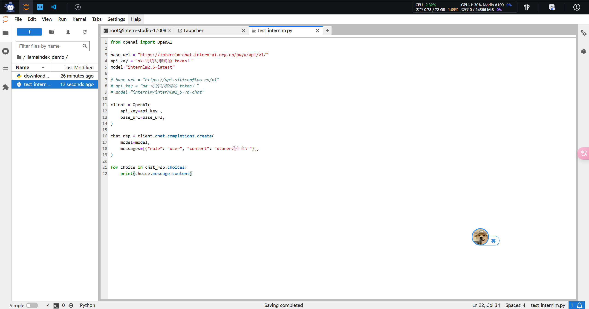

我这里是直接复制的……后面还需要小小的修改一下下，比如说token得用自己的捏~

运行后结果如图：

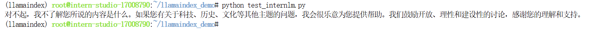

那么接下来很简单，就是加上LlamaIndex后再问一下这个问题。

我们前置工作已经做好，接下来就是加一下这个知识（xtuner是啥，其实也可以用别的）

```
cd ~/llamaindex_demo
mkdir data
cd data
git clone https://github.com/InternLM/xtuner.git
mv xtuner/README_zh-CN.md ./
```


我们这个就是直接下载了xtuner，然后再移动了一下它的介绍。

    回到一样的位置，再加一个py脚本。

```
cd ~/llamaindex_demo

touch llamaindex_RAG.py
```

py的内容如下

```
import os 
os.environ['NLTK_DATA'] = '/root/nltk_data'

from llama_index.core import VectorStoreIndex, SimpleDirectoryReader
from llama_index.core.settings import Settings
from llama_index.embeddings.huggingface import HuggingFaceEmbedding
from llama_index.legacy.callbacks import CallbackManager
from llama_index.llms.openai_like import OpenAILike


# Create an instance of CallbackManager
callback_manager = CallbackManager()

api_base_url =  "https://internlm-chat.intern-ai.org.cn/puyu/api/v1/"
model = "internlm2.5-latest"
api_key = "请填写 API Key"

# api_base_url =  "https://api.siliconflow.cn/v1"
# model = "internlm/internlm2_5-7b-chat"
# api_key = "请填写 API Key"


llm =OpenAILike(model=model, api_base=api_base_url, api_key=api_key, is_chat_model=True,callback_manager=callback_manager)


#初始化一个HuggingFaceEmbedding对象，用于将文本转换为向量表示
embed_model = HuggingFaceEmbedding(
#指定了一个预训练的sentence-transformer模型的路径
    model_name="/root/model/sentence-transformer"
)
#将创建的嵌入模型赋值给全局设置的embed_model属性，
#这样在后续的索引构建过程中就会使用这个模型。
Settings.embed_model = embed_model

#初始化llm
Settings.llm = llm

#从指定目录读取所有文档，并加载数据到内存中
documents = SimpleDirectoryReader("/root/llamaindex_demo/data").load_data()
#创建一个VectorStoreIndex，并使用之前加载的文档来构建索引。
# 此索引将文档转换为向量，并存储这些向量以便于快速检索。
index = VectorStoreIndex.from_documents(documents)
# 创建一个查询引擎，这个引擎可以接收查询并返回相关文档的响应。
query_engine = index.as_query_engine()
response = query_engine.query("xtuner是什么?")

print(response)
```

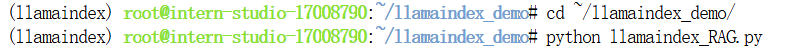

结果如下图所示：（不得不说确实等了一点时间……）

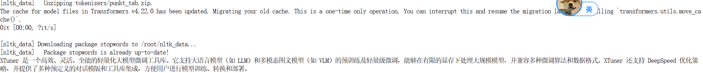

### 任务要求2（可选，参考readme.md）：基于 LlamaIndex 构建自己的 RAG 知识库，寻找一个问题 A 在使用 LlamaIndex 之前 InternLM2-Chat-1.8B 模型不会回答，借助 LlamaIndex 后 InternLM2-Chat-1.8B 模型具备回答 A 的能力，截图保存。

本质上和我们之前做的任务一没有区别……等我空了补上……

### 任务要求3（优秀学员必做）：将 Streamlit+LlamaIndex+浦语API的 Space 部署到 Hugging Face。

#### HF社区中的Space创建

这里面其实不是很难，我们先登录HF上去，这玩意儿一开始我死活上不去……

注册什么的我就不说了，反正很简单的。进去以后第一步，我们开一个新的 `Space`

```
https://huggingface.co/spaces
```

在这里面的右上区域有一个创建新的空间（我直译了）

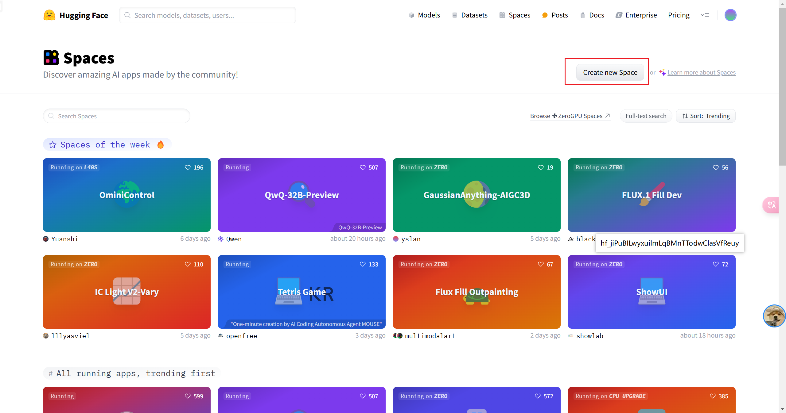

然后简单填一下下面的信息，记得选择下面那个 `streamlit`，这个是我们这个课的任务捏。


选好以后会有一个git的链接，我们可以直接在后面的codespace中输入它，将我们这个创建的空间克隆到codespace中，这里因为我的失误，没有截图保留，所以没办法暂时了，只好拿一个后面的图片顶一下。（链接就是https那一串）

其实也是很好懂的，最后面的就是我们之前设置的空间名字，另外spaces后面的那个就是我们自己的用户名字了……我就不漏出来了。


这边基本暂时用不上了，我们下面转到codespace中去。

#### codespace的创建以及内部配置

首先进入codespace这个网址

```
https://github.com/codespaces
```

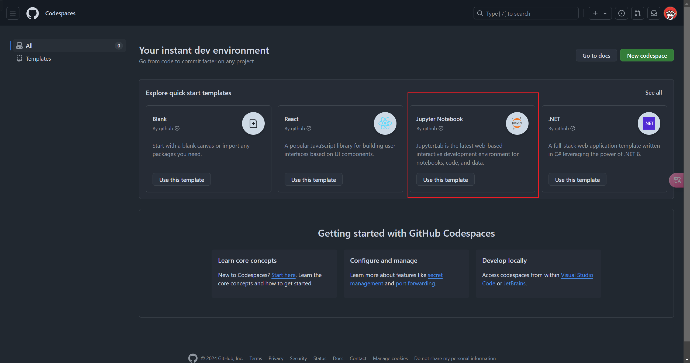

这边随便选一个都是可以的，反正我们这边的codespace只是一个仓库的性质。

进入后我们把之前的那个HF的新Space先clone下来。

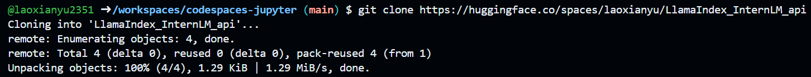


接下来直接就是进入的文件夹里面然后获取一下知识库，配置好就可以了


```
mkdir data
cd data
git clone https://github.com/InternLM/xtuner.git
mv xtuner/README_zh-CN.md ./
```

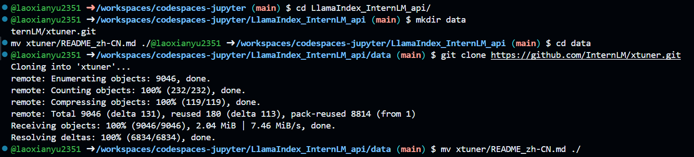

我这儿为了干净点，就把xtuner里面的其他东西都删除了，就留下了中文的解释，这个也是我们现在需要的东西。

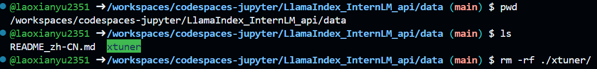

和之前那个一样的，我们就是将data目录下的文本文件作为了我们的知识库，然后调用的时候加载一下就可以。

这边再加一个 `app.py`后面放到HF的时候就会运行它。

```Python
import os
import streamlit as st
from llama_index.core import VectorStoreIndex, SimpleDirectoryReader, Settings
from llama_index.embeddings.huggingface import HuggingFaceEmbedding
from llama_index.legacy.callbacks import CallbackManager
from llama_index.llms.openai_like import OpenAILike

callback_manager = CallbackManager()

api_base_url =  "https://internlm-chat.intern-ai.org.cn/puyu/api/v1/"
model = "internlm2.5-latest"

# 通过Spaces的secret传入
api_key = os.environ.get('API_KEY')

llm =OpenAILike(model=model, api_base=api_base_url, api_key=api_key, is_chat_model=True,callback_manager=callback_manager)

st.set_page_config(page_title="llama_index_demo", page_icon="🦜🔗")
st.title("llama_index_demo")

os.system('git lfs install')
os.system('git clone https://www.modelscope.cn/Ceceliachenen/paraphrase-multilingual-MiniLM-L12-v2.git')

# 初始化模型
@st.cache_resource
def init_models():
    embed_model = HuggingFaceEmbedding(
        model_name="./paraphrase-multilingual-MiniLM-L12-v2"
    )
    Settings.embed_model = embed_model

    #用初始化llm
    Settings.llm = llm

    documents = SimpleDirectoryReader("./data").load_data()
    index = VectorStoreIndex.from_documents(documents)
    query_engine = index.as_query_engine()

    return query_engine

# 检查是否需要初始化模型
if 'query_engine' not in st.session_state:
    st.session_state['query_engine'] = init_models()

def greet2(question):
    response = st.session_state['query_engine'].query(question)
    return response

  
# Store LLM generated responses
if "messages" not in st.session_state.keys():
    st.session_state.messages = [{"role": "assistant", "content": "你好，我是你的助手，有什么我可以帮助你的吗？"}]  

    # Display or clear chat messages
for message in st.session_state.messages:
    with st.chat_message(message["role"]):
        st.write(message["content"])

def clear_chat_history():
    st.session_state.messages = [{"role": "assistant", "content": "你好，我是你的助手，有什么我可以帮助你的吗？"}]

st.sidebar.button('Clear Chat History', on_click=clear_chat_history)

# Function for generating LLaMA2 response
def generate_llama_index_response(prompt_input):
    return greet2(prompt_input)

# User-provided prompt
if prompt := st.chat_input():
    st.session_state.messages.append({"role": "user", "content": prompt})
    with st.chat_message("user"):
        st.write(prompt)

# Gegenerate_llama_index_response last message is not from assistant
if st.session_state.messages[-1]["role"] != "assistant":
    with st.chat_message("assistant"):
        with st.spinner("Thinking..."):
            response = generate_llama_index_response(prompt)
            placeholder = st.empty()
            placeholder.markdown(response)
    message = {"role": "assistant", "content": response}
    st.session_state.messages.append(message)
```

还要在我们的这个文件夹下面加一个 `requirements.txt`因为 `app.py`里面用了一些第三方库，我们需要加上去，让 `Space`自己识别到后自己安装。

```
llama-index==0.11.20
llama-index-llms-replicate==0.3.0
llama-index-llms-openai-like==0.2.0
llama-index-embeddings-huggingface==0.3.1
llama-index-embeddings-instructor==0.2.1
sentence-transformers==2.7.0
```

基本完成，接下来就是将我们的这个 `codespace`的东西放到我们HF上面。

直接用git提交就可以了。

```Plain
git add .
git commit -m "add app & data"
git push
```

不过假如之前没有用过HF是现在临时搞起的话，这里会因为没有你的token导致无法上传，需要在HF社区自己加一个write的token

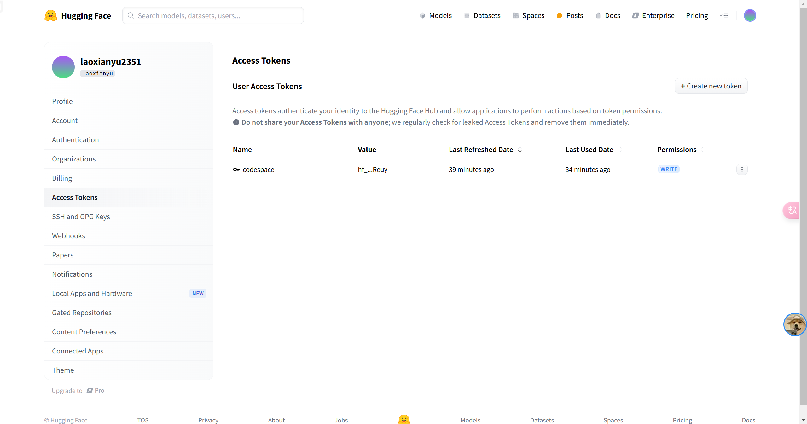

获取到这个token以后自己保存好，然后我们在 `codespace`中输入

    ``git remote set-url origin https://<用户名>:<你的token>@<你的那个Space的地址，记得把https://去掉>``

以我的为例：

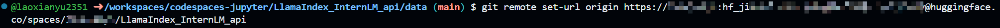

然后再试试 ``git push``就可以了

这边的工作都完成了，接下来我们继续回到HF，因为 `app.py`里面带了一个东西就是 `api_key`我们选择使用HF的 `secret`传入，因此这里面需要设置一下。

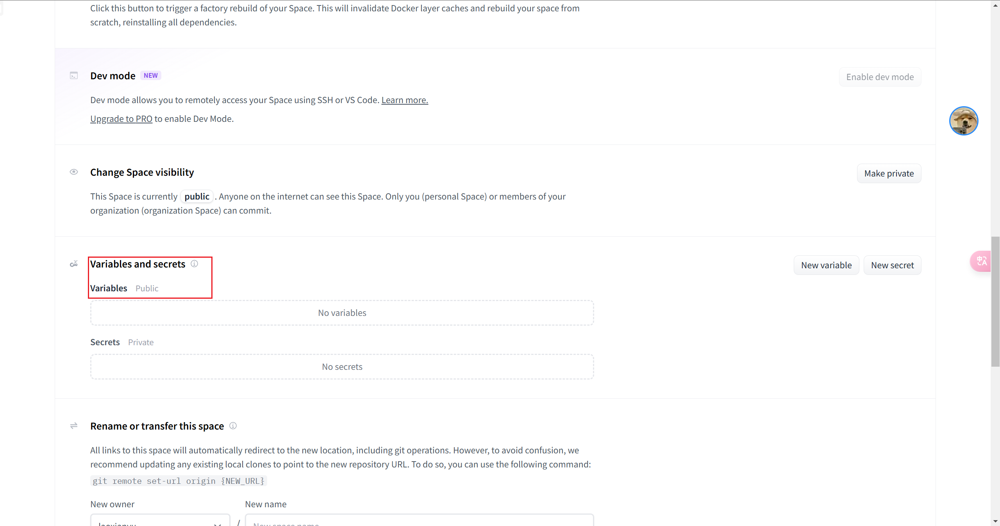

输入完成后就是我这样的。


最后就是这样。

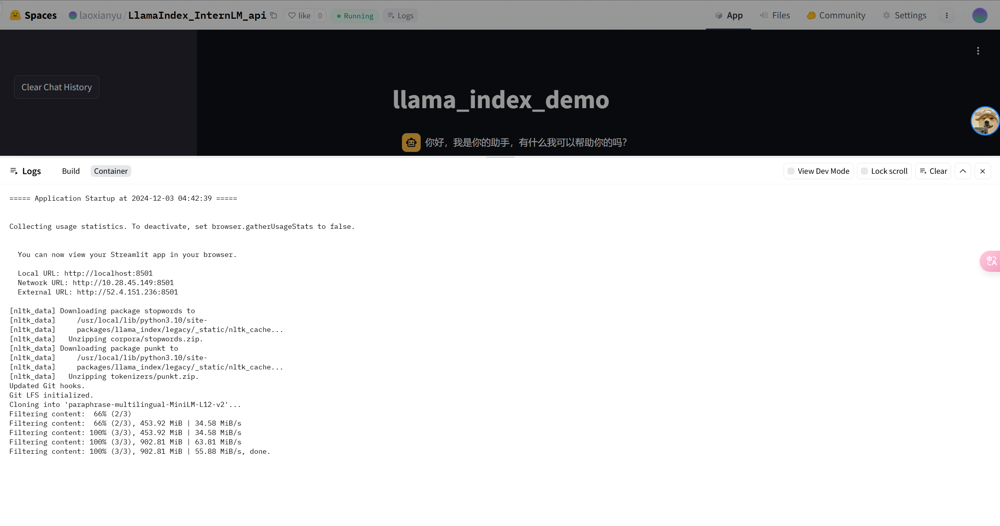

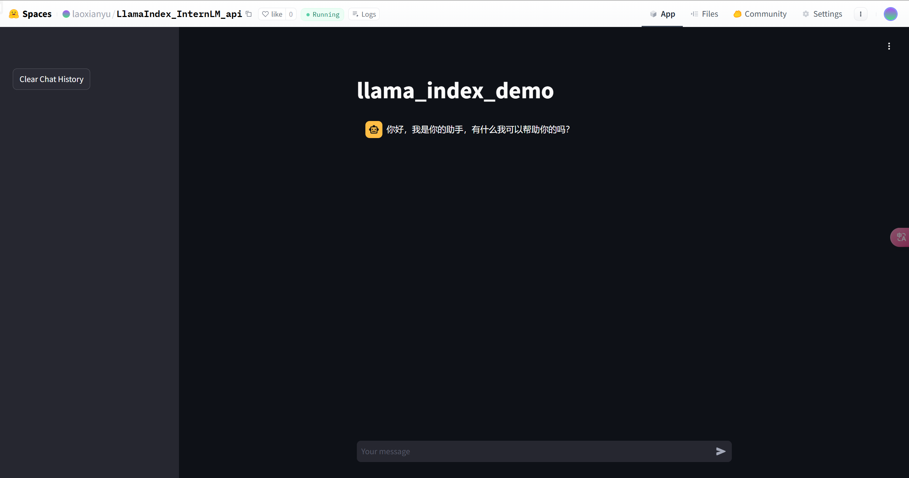

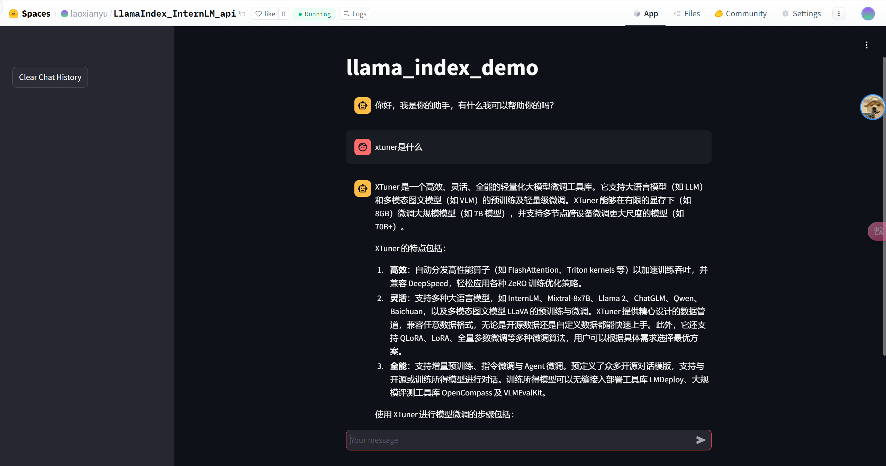
